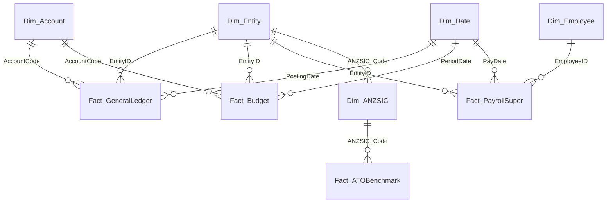

# Australian Accounting Power BI

[](https://github.com/ryanduguid/accounting-review-pipeline/actions/workflows/australian-accounting-power-bi.yml) [](LICENSE)

Maintain this application at [Accounting Review Pipeline](https://github.com/ryanduguid/accounting-review-pipeline/tree/main/apps/australian-accounting-power-bi). Run the commands below from `apps/australian-accounting-power-bi/`. Use the root [Xero trial-balance contract](../../contracts/xero-trial-balance-v1/) for the canonical CSV header, fixtures and expected results, and [Xero Trial Balance Export](https://github.com/ryanduguid/accounting-review-pipeline/tree/main/packages/xero-trial-balance-export) for its producer. The report's native smoke uses its own fabricated `samples/` model; the contract checks do not prove a native model refresh.

**Status: incubating.** This source-controlled Power BI Project (`.pbip`) is an evolving reference implementation, not a production-ready Power BI solution. It demonstrates Australian accounting domain modelling, dimensional star schema design, Tabular Model Definition Language (TMDL), calculation groups, and automated GitHub Actions CI verification.

---

## What This Project Solves

This project keeps Power BI models and reports in text files so changes can be reviewed in git:
1. **Plain-Text Version Control**: Built entirely on the Power BI Project format (`.pbip`), using Tabular Model Definition Language (`.tmdl`) and Enhanced Report Format (`.pbir`). Measures, visuals, relationships, and M expressions produce reviewable git diffs.
2. **Multi-Entity Consolidation & Financial Statements**: P&L matrix reporting and balance sheet measures across a multi-entity corporate group (operating company, trading subsidiary, logistics entity, property trust) with automated intercompany transaction eliminations.
3. **ATO Small Business Benchmarks Diagnostic**: Selects one sample benchmark band using an entity's industry and full financial-year turnover. Gross profit is compared with that band's inclusive lower and upper bounds. The result describes a sample variance and does not estimate audit risk.
4. **Payday Super Review with Sample Data**: Checks fabricated Single Touch Payroll Phase 2 events (Code Q - Qualifying Earnings, Code L - Super Liability at 12.0%) against the statutory 7-business-day fund receipt rule commencing 1 July 2026, including automated SG charge and notional earnings exposure calculators.

---

## Data Model Architecture (Star Schema)



See [docs/data-model.md](docs/data-model.md) for table grain, schema descriptions, and dimension attributes.

---

## Report Structure (4 Pages)

1. **Executive Financial Performance**: Consolidated P&L matrix with revenue, gross margin, EBITDA, and net asset cards, and a cumulative working capital trend.
2. **Multi-Entity Consolidation & Eliminations**: Entity-level matrix views with automated intra-group elimination columns and intercompany loan audit trails.
3. **ATO Benchmark & Practice Diagnostic**: Industry and turnover-band comparisons, gross margin and cost ratios, and a gross profit comparison against the sample range.
4. **Payday Super & STP Compliance Monitor**: 7-business-day timeline tracker, clearing-house transit risk analyser, and estimated Super Guarantee Charge (SGC) exposure calculators.

---

## Calculation Groups & Advanced DAX

The semantic model uses calculation groups to dynamically apply time intelligence and consolidation filters across any base measure without measure proliferation:

- **`CalcGroup_TimeIntelligence`**: Supports Base Period, MTD, QTD, FYTD (1 July to 30 June Australian financial year), Prior Year (PY), YoY Variance (\$), and YoY Variance (%).
- **`CalcGroup_Consolidation`**: Supports Gross Group Total, Intercompany Eliminations, and Consolidated Group Net.

See [docs/dax-patterns.md](docs/dax-patterns.md) for full DAX formulas and precedence rules.

---

## Repository Layout

```text
australian-accounting-power-bi/
├── docs/
│   ├── data-model.md                    # Star schema diagram & dimension specifications
│   ├── dax-patterns.md                  # Calculation groups & financial statement DAX
│   └── compliance-methodology.md        # Australian tax & Payday Super calculation rules
├── australian-accounting-power-bi.pbip  # Power BI Project root descriptor
├── australian-accounting-power-bi.Report/ # Enhanced Report Format (PBIR)
│   ├── .platform                         # Fabric item metadata
│   ├── definition.pbir
│   └── definition/
│       ├── version.json
│       ├── report.json                  # Report settings and base theme
│       └── pages/                       # Four pages and 21 source-controlled visuals
├── australian-accounting-power-bi.SemanticModel/ # Tabular Model Definition Language (TMDL)
│   ├── definition.pbism                 # Semantic model descriptor
│   └── definition/
│       ├── database.tmdl                # Database compatibility and language
│       ├── model.tmdl                   # Canonical table and expression references
│       ├── relationships.tmdl           # Unidirectional star schema relationships
│       ├── expressions.tmdl             # SampleFolder parameter and eight M queries/functions
│       └── tables/                      # Dimensions, facts, and calculation groups
├── samples/                             # Deterministic fabricated CSV fixtures
│   ├── sample-entities.csv              # Varrock Ventures, Draynor Produce, Falador Freight
│   ├── sample-chart-of-accounts.csv     # Standard Australian Chart of Accounts
│   ├── sample-general-ledger.csv        # Balanced double-entry GL journals (FY25-FY27)
│   ├── sample-budgets.csv               # Monthly departmental budgets
│   ├── sample-payroll-super.csv         # Payday Super events with on-time & late receipts
│   └── sample-ato-benchmarks.csv        # Sample industry and turnover-band reference values
├── tests/
│   ├── test_fixtures_balance.py         # Asserts debits == credits per journal and period
│   ├── test_tmdl_integrity.py           # Asserts TMDL syntax, explicit measure formats, descriptions
│   ├── test_powerquery_m.py             # Validates embedded Power Query M and fixture widths
│   ├── test_pbip_structure.py           # Validates PBIP layout and report-to-model bindings
│   ├── test_payday_super_rules.py       # Verifies Payday Super 7-business-day statutory rules
│   └── model_bpa_rules.json             # Tabular Model Best Practice Analyzer ruleset
├── tools/
│   └── generate_fixtures.py             # Script to deterministically generate all synthetic test data
├── LICENSE                              # MIT License
├── DISCLAIMER.md                        # Professional disclaimer
├── CONTRIBUTING.md                      # Contribution guidelines
└── SECURITY.md                          # Security policy
```

---

## Verification & Automated Testing

Run the test suite locally:

```bash
python -B -m unittest discover -s tests -v
```

With Node.js 24 available, run Microsoft's pinned PBIR validator:

```bash
npx --yes @microsoft/powerbi-report-authoring-cli@0.1.4 validate australian-accounting-power-bi.Report
```

The test suite verifies:
- Every journal in `sample-general-ledger.csv` balances to zero (debits equal credits).
- Intercompany entries balance to zero across the group.
- The committed fixtures regenerate byte-for-byte from `tools/generate_fixtures.py`, and every sample ABN passes the statutory modulus-89 checksum.
- Every relationship the ER diagrams document exists, and `Dim_ANZSIC` declares every industry code the entity and benchmark fixtures join on.
- Every DAX measure uses supported `///` description syntax, and every numeric measure has an explicit format string.
- All relationships enforce strict single-direction star schema filtering.
- All eight named Power Query expressions use balanced `let ... in` blocks, valid fixture widths, and valid ABN algorithm weights.
- The semantic model uses the supported TMDL folder contract and resolves every import partition.
- All four report pages and 21 visuals are materialised, and every visual field binding resolves to a declared model column or measure.
- Payday Super tests assert 12.0% SG rate, 7-business-day national calendar calculation, and leap year GIC divisors (366 days in leap years per s 8AAD TAA).

The root [Power BI workflow](../../.github/workflows/australian-accounting-power-bi.yml) runs both the Python suite and the pinned Microsoft PBIR validator.

---

## Opening the Project

1. Open `australian-accounting-power-bi.pbip` in **Power BI Desktop**.
2. Under **Home > Transform data > Edit parameters**, set `SampleFolder` to the absolute path of this checkout's `samples` folder, then apply the change. The committed parameter is blank because the folder location differs on each PC.
3. Select **Home > Refresh > Schema and data**, then inspect all four report pages.
4. On the benchmark page, use the Filters pane to select one `Dim_Date[FinancialYear]`. Select one entity for the comparison card; each entity row in the matrix supplies its own entity selection. Multiple entities or years have no combined benchmark.

The turnover band uses revenue for the complete selected financial year, even when a month or account is filtered. Ratios describe the currently displayed period, so use the complete year for an annual comparison. The sample bands use a strict lower turnover bound and an inclusive upper bound: $1,000,000 belongs to the $500k-$1m band; $1,000,001 belongs to $1m-$5m. Gross profit bounds include both endpoints. Missing or overlapping bands leave the comparison unavailable. See [benchmark verification](docs/benchmark-verification.md).

You can also inspect the semantic model directory in **Tabular Editor 3 / 2**, or edit TMDL files in **Visual Studio Code** with the Microsoft TMDL extension.

The [8 September 2026 native verification](docs/native-verification.md) records a fabricated-data refresh and inspection of all four pages in Desktop 2.157.1354.0. Automated checks cover structure and bindings; repeat the native check after model or report changes. This smoke test does not establish production readiness or validate every accounting calculation.

---

## Disclaimer

Utility code, MIT-licensed, no warranty. Nothing here constitutes tax, financial, or legal advice. Outputs and calculations require independent professional review. All sample data is fabricated using synthetic entities.

---

## Author

Ryan Duguid, accountant in Newcastle NSW, provisional member of Chartered Accountants ANZ.
