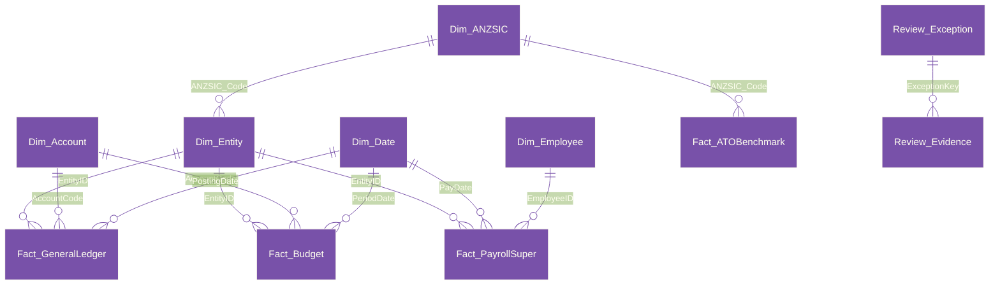

# Australian Accounting Power BI

[](https://github.com/ryanduguid/accounting-review-pipeline/actions/workflows/standard-library-components.yml) [](LICENSE)

Maintain this application at [Accounting Review Pipeline](https://github.com/ryanduguid/accounting-review-pipeline/tree/main/apps/australian-accounting-power-bi). Run the commands below from `apps/australian-accounting-power-bi/`. Use the root [Xero trial-balance contract](../../contracts/xero-trial-balance-v1/) for the canonical CSV header, fixtures and expected results, and [Xero Trial Balance Export](https://github.com/ryanduguid/accounting-review-pipeline/tree/main/packages/xero-trial-balance-export) for its producer. The report's native smoke uses its own fabricated `samples/` model; the contract checks do not prove a native model refresh.

**Status: incubating.** This source-controlled Power BI Project (`.pbip`) is an evolving reference implementation, not a production-ready Power BI solution. It demonstrates Australian accounting domain modelling, dimensional star schema design, Tabular Model Definition Language (TMDL), calculation groups, and automated GitHub Actions CI verification.

---

## What this project solves

This project keeps Power BI models and reports in text files so changes can be reviewed in git:
1. **Plain-Text Version Control**: Built entirely on the Power BI Project format (`.pbip`), using Tabular Model Definition Language (`.tmdl`) and Enhanced Report Format (`.pbir`). Measures, visuals, relationships, and M expressions produce reviewable git diffs.
2. **Multi-Entity Consolidation & Financial Statements**: P&L matrix reporting and balance sheet measures across a multi-entity corporate group (operating company, trading subsidiary, logistics entity, property trust) with refresh checks for paired intercompany entries and eliminations limited to the complete group.
3. **ATO Small Business Benchmarks Diagnostic**: Selects one sample benchmark band using an entity's industry and full financial-year turnover. Gross profit is compared with that band's inclusive lower and upper bounds. The result describes a sample variance and does not estimate audit risk.
4. **Payroll receipt review with sample data**: Compares recorded receipt dates with supplied deadlines and displays modelled charge estimates. Full payment is assumed because the source has no receipt amount. Missing receipts are refused; partial payments and statutory exceptions need a separate assessment.

---

## Data model architecture (star schema)


```mermaid
erDiagram
%%{init: {"theme": "base", "themeVariables": {"background": "#000000", "primaryColor": "#7851A9", "primaryTextColor": "#FFFFF0", "primaryBorderColor": "#FFFFF0", "lineColor": "#7851A9", "textColor": "#FFFFF0", "edgeLabelBackground": "#000000", "attributeBackgroundColorOdd": "#000000", "attributeBackgroundColorEven": "#000000"}}}%%
    Dim_Entity ||--o{ Fact_GeneralLedger : "EntityID"
    Dim_Entity ||--o{ Fact_Budget : "EntityID"
    Dim_Entity ||--o{ Fact_PayrollSuper : "EntityID"
    
    Dim_Account ||--o{ Fact_GeneralLedger : "AccountCode"
    Dim_Account ||--o{ Fact_Budget : "AccountCode"
    
    Dim_Date ||--o{ Fact_GeneralLedger : "PostingDate"
    Dim_Date ||--o{ Fact_Budget : "PeriodDate"
    Dim_Date ||--o{ Fact_PayrollSuper : "PayDate"
    
    Dim_Employee ||--o{ Fact_PayrollSuper : "EmployeeID"
    
    Dim_ANZSIC ||--o{ Dim_Entity : "ANZSIC_Code"
    Dim_ANZSIC ||--o{ Fact_ATOBenchmark : "ANZSIC_Code"
    Review_Exception ||--o{ Review_Evidence : "ExceptionKey"
```

See [docs/data-model.md](docs/data-model.md) for table grain, schema descriptions, and dimension attributes.

---

## Report structure (6 pages)

1. **Close review**: Opens on the verified September 2024 fabricated case. A compact findings list sits beside the selected finding's full action, question, reason and evidence request. Amounts use thousands grouping and parentheses for negative values; controls not run have readable labels. Select a finding row, then View journal evidence. The optional Finding filter keeps an account choice after Back.
2. **Financial performance**: Entity, financial year, month and reporting-basis selectors; actual and prior-year profit and loss; revenue against budget; working capital and net assets. The initial period is FY25-26. Budgets are available only on the gross basis.
3. **Group balances**: Gross, elimination and net account balances with an intercompany-only journal trail. Recorded equity excludes unclosed earnings. Net and elimination amounts require the complete wholly owned AUD group. Clear Reporting basis to compare all three columns.
4. **Industry comparison**: A selected entity's gross profit range and total expense ratio against fabricated references, with labelled bars for actual and sample ratios. The initial selection is Draynor Fresh Foods in FY25-26. These values are not published ATO benchmarks.
5. **Payroll receipts**: Entity, year, regime and receipt-status selectors. Late Payday sample receipts in FY26-27 are selected initially. The cards and detail follow those selections. Part-day holiday cases require calendar review, and total charge and interest estimates are withheld while such cases are selected. Rates after December 2026 are projected.

6. **Supporting journal rows**: Receives the selected exception, entity, period, basis and run through native drillthrough. A separate audit details table shows the complete run identifier. Back retains the optional Finding filter; a directly selected table row clears on return. This page is hidden from the page navigator.

The five main pages use native navigation, a shared theme, descriptive alt text and an authored spatial tab order. The context strip names the selected entities and dates. Each page keeps its own selections. All six pages also have portrait layouts for phone use. Results stack vertically, navigation uses two columns and selected-finding text wraps within the canvas. Swipe dense tables horizontally for supporting columns. Desktop phone preview is checked; behaviour on a physical phone remains unverified. Clearing the year includes all loaded years, including fabricated future periods. Expand account groups to inspect detail. The [model controls](docs/model-controls.md) explain input rejection, supported calculations and limits. The [report design record](docs/report-design.md) links the dashboard references and records the accessibility and performance checks still needed.

---

## Calculation groups and advanced DAX

The semantic model uses calculation groups to dynamically apply time intelligence and consolidation filters across the measures each calculation supports:

- **`CalcGroup_TimeIntelligence`**: Supports Base Period, MTD, QTD, FYTD (1 July to 30 June Australian financial year), Prior Year (PY), YoY Variance (\$), and YoY Variance (%).
- **`CalcGroup_Consolidation`**: Supports Gross Group Total, Intercompany Eliminations, and Consolidated Group Net.

See [docs/dax-patterns.md](docs/dax-patterns.md) for full DAX formulas and precedence rules.

---

## Repository layout

```text
australian-accounting-power-bi/
├── docs/
│   ├── data-model.md                    # Star schema diagram & dimension specifications
│   ├── dax-patterns.md                  # Calculation groups & financial statement DAX
│   └── compliance-methodology.md        # Australian tax & Payday Super calculation rules
├── australian-accounting-power-bi.pbip  # Power BI Project root descriptor
├── australian-accounting-power-bi.Report/ # Enhanced Report Format (PBIR)
│   ├── .platform                         # Fabric item metadata
│   ├── definition.pbir
│   └── definition/
│       ├── version.json
│       ├── report.json                  # Report settings and base theme
│       └── pages/                       # Six pages with native controls and visuals
├── australian-accounting-power-bi.SemanticModel/ # Tabular Model Definition Language (TMDL)
│   ├── definition.pbism                 # Semantic model descriptor
│   └── definition/
│       ├── database.tmdl                # Database compatibility and language
│       ├── model.tmdl                   # Canonical table and expression references
│       ├── relationships.tmdl           # Unidirectional star schema relationships
│       ├── expressions.tmdl             # SampleFolder, supported horizon and M queries/functions
│       └── tables/                      # Dimensions, facts, and calculation groups
├── samples/                             # Deterministic fabricated CSV fixtures
│   ├── sample-entities.csv              # Varrock Ventures, Draynor Produce, Falador Freight
│   ├── sample-chart-of-accounts.csv     # Standard Australian Chart of Accounts
│   ├── sample-general-ledger.csv        # Balanced double-entry GL journals (FY25-FY27)
│   ├── sample-budgets.csv               # Monthly departmental budgets
│   ├── sample-payroll-super.csv         # Payday Super events with on-time & late receipts
│   └── sample-ato-benchmarks.csv        # Sample industry and turnover-band reference values
├── tests/
│   ├── test_fixtures_balance.py         # Asserts debits == credits per journal and period
│   ├── test_tmdl_integrity.py           # Asserts TMDL syntax, explicit measure formats, descriptions
│   ├── test_powerquery_m.py             # Validates embedded Power Query M and fixture widths
│   ├── test_pbip_structure.py           # Validates PBIP layout and report-to-model bindings
│   ├── test_payday_super_rules.py       # Verifies Payday Super 7-business-day statutory rules
│   └── model_bpa_rules.json             # Tabular Model Best Practice Analyzer ruleset
├── tools/
│   └── generate_fixtures.py             # Script to deterministically generate all synthetic test data
├── LICENSE                              # MIT License
├── DISCLAIMER.md                        # Professional disclaimer
├── CONTRIBUTING.md                      # Contribution guidelines
└── SECURITY.md                          # Security policy
```

---

## Verification and automated testing

Run the test suite locally:

```bash
python -B -m unittest discover -s tests -v
```

With Node.js 24 available, run Microsoft's PBIR validator from the reviewed, lockfile-pinned dependency tree beside the report:

```bash
npm ci --ignore-scripts
npx --no-install powerbi-report-author validate australian-accounting-power-bi.Report
```

The test suite verifies:
- Every journal in `sample-general-ledger.csv` balances to zero (debits equal credits).
- Intercompany entries reconcile by counterparty pair, date and balance-sheet or profit-and-loss leg. Removing one balanced counterparty journal fails the check.
- The committed fixtures regenerate byte-for-byte from `tools/generate_fixtures.py`, and every sample ABN passes the statutory modulus-89 checksum.
- Every relationship the ER diagrams document exists, and `Dim_ANZSIC` declares every industry code the entity and benchmark fixtures join on.
- Every DAX measure uses supported `///` description syntax, and every numeric measure has an explicit format string.
- All relationships enforce strict single-direction star schema filtering.
- All embedded Power Query expressions use balanced `let ... in` blocks, valid fixture widths, and valid ABN algorithm weights.
- The semantic model uses the supported TMDL folder contract and resolves every import partition.
- All 6 report pages and 59 visuals are materialised, and every visual field binding resolves to a declared model column or measure. Regression checks cover alignment, overlap, shared component styles and unique query aliases.
- Payday Super tests assert 12.0% SG rate, 7-business-day national calendar calculation, and leap year GIC divisors (366 days in leap years per s 8AAD TAA).

The root [standard-library components workflow](../../.github/workflows/standard-library-components.yml) runs both the Python suite and the pinned Microsoft PBIR validator.

---

## Opening the project

1. Open `australian-accounting-power-bi.pbip` in **Power BI Desktop**.
2. Under **Home > Transform data > Edit parameters**, set `SampleFolder` to the absolute path of this checkout's `samples` folder, then apply the change. The committed parameter is blank because the folder location differs on each PC.
3. In **Transform data > Data source settings > Data sources in current file**, select each of the 9 sample CSV files. Choose **Edit Permissions**, set **Privacy Level** to **Public**, then select **OK**. This setting is appropriate for these fabricated fixtures only. Classify any other dataset according to its actual sensitivity. Do not disable privacy checks globally.
4. Close the settings dialog, then **Close & Apply**. Select **Home > Refresh > Schema and data**, complete any sample-source privacy prompts, and inspect all 6 report pages.
5. Use the visible selectors on each page. In Desktop edit mode, Ctrl+click a page navigator button to follow it. The benchmark comparison requires one financial year and one entity; each matrix row also supplies its own entity selection. Multiple entities or years have no combined benchmark.

The project definition uses compatibility level **1606**, matching the verified Desktop model. A definition at 1600 cannot reopen a local model already saved at 1606: Desktop reports that tabular databases do not support a compatibility-level downgrade. Keep the definition at 1606 when applying these changes to an existing checkout; deleting the local model cache is unnecessary for this correction.

The turnover band uses revenue for the complete selected financial year, even when a month or account is filtered. Ratios describe the currently displayed period, so use the complete year for an annual comparison. The sample bands use a strict lower turnover bound and an inclusive upper bound: $1,000,000 belongs to the $500k-$1m band; $1,000,001 belongs to $1m-$5m. Gross profit bounds include both endpoints. Missing or overlapping bands leave the comparison unavailable. See [benchmark verification](docs/benchmark-verification.md).

You can also inspect the semantic model directory in **Tabular Editor 3 / 2**, or edit TMDL files in **Visual Studio Code** with the Microsoft TMDL extension.

The [native verification record](docs/native-verification.md) includes the 25 September 2026 fabricated-data refresh and inspection of all 4 pages in Desktop 2.157.1354.0. Automated checks cover structure and bindings; repeat the native check after model or report changes. This smoke test does not establish production readiness or validate every accounting calculation.

---

## Disclaimer

Utility code, MIT-licensed, no warranty. Nothing here constitutes tax, financial, or legal advice. Outputs and calculations require independent professional review. All sample data is fabricated using synthetic entities.

---

## Author

Ryan Duguid, accountant in Newcastle NSW, provisional member of Chartered Accountants ANZ.

The [synthetic close review workflow](docs/review-workflow.md) adds a close review home, filtered journal evidence, an offline comparison record and repeatable Desktop preparation using one pinned fabricated case.
