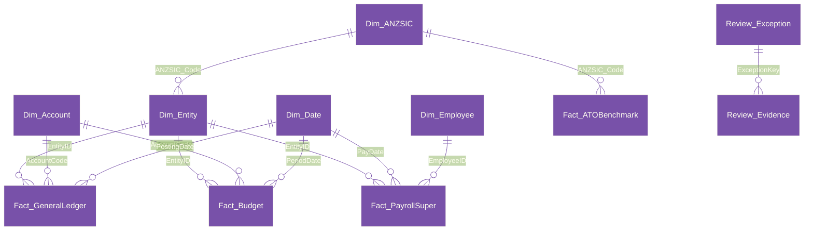

# Dimensional data model architecture

The semantic model follows Kimball star schema principles, strictly separating dimension tables from fact tables with unidirectional `1:*` relationships to ensure optimal DAX performance and unambiguous filter propagation.

---

## 1. Dimension tables

### `Dim_Date` (Australian financial year calendar)
- **Primary Key**: `Date`
- **Granularity**: One row per calendar day (1 July 2024 to 30 June 2027).
- **Core Attributes**:
  - `CalendarYear`, `MonthNumber`, `MonthName`, `DayOfMonth`, `DayOfWeek`, `DayName`.
  - `FinancialYear`: Australian financial year label (for example, `FY24-25`, `FY25-26`, `FY26-27`).
  - `FinancialQuarter`: `FQ1` (Jul-Sep), `FQ2` (Oct-Dec), `FQ3` (Jan-Mar), `FQ4` (Apr-Jun).
  - `FinancialMonthNumber`: `1` (July) through `12` (June).
  - `FYStartDate`, `FYEndDate`: Standard financial period boundaries.

### `Dim_Entity` (multi-entity corporate hierarchy)
- **Primary Key**: `EntityID`
- **Granularity**: One row per legal entity in the corporate group.
- **Foreign Keys**: `ANZSIC_Code` -> `Dim_ANZSIC[ANZSIC_Code]`. Many entities share one industry row, so the industry dimension filters the entity dimension and not the reverse.
- **Attributes**: `LegalName`, `TradingName`, `ABN`, `ACN`, `TaxStructure` (Company versus Unit Trust), `EntityRole`, `ANZSIC_Code`, `Currency`, `ConsolidationWeight`.

### `Dim_Account` (chart of accounts and financial reporting)
- **Primary Key**: `AccountCode`
- **Granularity**: One row per general ledger account.
- **Attributes**: `AccountName`, `Class` (Asset, Liability, Equity, Revenue, Expense), `SubClass`, `ReportSection` (Balance Sheet versus Profit and Loss), `BalanceSheetGroup`, `CashFlowCategory` (Operating, Investing, Financing), `NormalBalance` (Debit/Credit), `SortOrder`.

### `Dim_ANZSIC` (industry classifications)
- **Primary Key**: `ANZSIC_Code`
- **Granularity**: One row per Australian and New Zealand Standard Industrial Classification 4-digit code.
- **Attributes**: `Division`, `Subdivision`, `IndustryTitle`.

### `Dim_Employee` (synthetic workforce master)
- **Primary Key**: `EmployeeID`
- **Granularity**: One row per employee using the latest pay date, with EventID as a deterministic tie-breaker. Entity and fund history remains on each payroll event; use fact attributes for historical analysis.
- **Attributes**: `EntityID`, `EmployeeName`, `SuperFundUSI`, `SuperFundName`.

---

## 2. Fact tables

### `Fact_GeneralLedger`
- **Granularity**: Individual double-entry journal lines.
- **Foreign Keys**: `PostingDate` -> `Dim_Date[Date]`, `EntityID` -> `Dim_Entity[EntityID]`, `AccountCode` -> `Dim_Account[AccountCode]`.
- **Measures / Metrics**: `Debit`, `Credit`, `Amount` (Net signed amount), `IntercompanyEntityID`, `IsIntercompany` (Boolean flag enabling automated consolidation eliminations).

### `Fact_Budget`
- **Granularity**: Monthly departmental financial budget per account.
- **Foreign Keys**: `PeriodDate` -> `Dim_Date[Date]`, `EntityID` -> `Dim_Entity[EntityID]`, `AccountCode` -> `Dim_Account[AccountCode]`.
- **Metrics**: `BudgetAmount`.

### `Fact_PayrollSuper`
- **Granularity**: Individual employee Single Touch Payroll (STP Phase 2) pay run events.
- **Foreign Keys**: `PayDate` -> `Dim_Date[Date]`, `EntityID` -> `Dim_Entity[EntityID]`, `EmployeeID` -> `Dim_Employee[EmployeeID]`.
- **Metrics**: `GrossEarnings`, `QualifyingEarnings_CodeQ`, `SuperLiability_CodeL` (12.0%), `RemittanceDate`, `FundReceiptDate`, `StatutoryDueDate` (7 national business days from payday), `ComplianceStatus`, `SGC_Shortfall`, `GIC_NominalInterest`. Derived fields `PaymentRegime` and `EstimateBasis` distinguish quarterly samples, published or projected rates and calendar review.

### `Fact_ATOBenchmark`
- **Granularity**: One fabricated sample reference row per ANZSIC code and turnover bracket. The values are invented for this sample model. They are not ATO benchmark percentiles and carry no source date, citation or percentile definition.
- **Foreign Keys**: `ANZSIC_Code` -> `Dim_ANZSIC[ANZSIC_Code]`.
- **Metrics**: `GrossProfitPct_Low`, `GrossProfitPct_Avg`, `GrossProfitPct_High`, `TotalExpensesPct_Avg`, `RentPct_Avg`, `MotorVehiclePct_Avg`, `LabourPct_Avg`.

## Refresh boundary

The six CSV headers are unchanged. Financial imports use Power Query `Currency.Type` and native fixed-decimal model columns; this is separate from the Python review packages' `Decimal` guarantee. The shared chart assumes a common meaning for each text account code across entities.

`ModelStartDate` and `ModelEndDate` define the ledger, budget and pay-date horizon. Budget dates must be month starts. `IndustryLookup` is the single classification lookup used by the dimension and import validation. `Dim_Account` derives account-group ordering from the chart's existing `SortOrder`.

See [model controls](model-controls.md) for validation rules and native rejection checks. These controls validate the supplied sample structure; they do not reconcile it to an external accounting system.

The review island has three tables: Review_Run, Review_Exception and Review_Evidence. Its single exception-key relationship remains separate from the financial model. Review amounts are exact producer text; its display measure checks selection and row presence only. See [review workflow](review-workflow.md).
