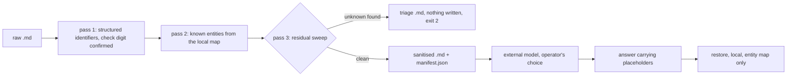

# evatt Implementation Plan

> **For agentic workers:** REQUIRED SUB-SKILL: Use superpowers:subagent-driven-development (recommended) or superpowers:executing-plans to implement this plan task-by-task. Steps use checkbox (`- [ ]`) syntax for tracking.

**Goal:** Build `evatt`, a local zero-network package that pseudonymises Australian client data in markdown files before they are handed to an external model, and reverses the named-entity substitution on the answer.

**Architecture:** Three commands over four passes. Structured identifiers are matched by regular expression and confirmed by check digit, then replaced one-way. Known entities are replaced from a local gitignored map using stable typed placeholders. Anything name-shaped, address-shaped or date-shaped that neither pass recognised halts the run and produces a triage file. Nothing is written until every unknown is classified.

**Tech Stack:** Python 3.10+, standard library only at runtime, setuptools build backend, uv for the locked toolchain, pytest, ruff, mypy.

**Spec:** `docs/superpowers/specs/2026-09-09-client-data-pseudonymisation-design.md`

## Global Constraints

Every task's requirements implicitly include this section.

- **Identity gate.** Directory leaf, distribution name, import package, console command and release tag prefix are all exactly `evatt`. The repository's release identity gate requires this and `AGENTS.md` records the decision.
- **No sibling imports.** `evatt` must not import `elizabeth_anne_alexander`, `reviewready`, or any other component. This is why `patterns.py` is copied rather than shared.
- **Zero network.** No HTTP client, no socket, no telemetry, no cloud call in runtime code or tests. Only `packages/xero-trial-balance-export/` may use a network client.
- **Runtime dependencies: none.** Standard library only. Dev extras are `ruff>=0.11`, `mypy>=1.14`, `build>=1.2`, `pytest>=8`.
- **Python:** `requires-python = ">=3.10"`. CI runs 3.12.
- **Build backend:** `requires = ["setuptools==84.0.0"]`.
- **uv:** version `0.12.0`, `uv lock --check` must pass, per-component `uv.lock`.
- **ruff:** `line-length = 100`, `select = ["E9", "F82"]`.
- **mypy:** `python_version = "3.10"`, `packages = ["evatt"]`.
- **Exit codes:** `0` clean, `2` halted on unknowns or verify findings, `1` malformed input. This mirrors the monthly-close component.
- **Claim wording.** Documentation says "pseudonymisation" and "the key never leaves the local machine". The strings `anonymised`, `de-identified data is not personal information`, `Privacy Act compliant` and `safe to send` must never appear as claims. Task 9 adds the test that enforces this.
- **Australian English, no em dashes** in all prose files. A repository hook rejects em dashes.
- **No client data, ever.** Every fixture is generated. No fixture is produced by redacting a real document.
- **Two gates outside this plan.** Do not `git push` until the employment agreement's IP clauses have been checked, and do not run `evatt` over real client data until the policy is signed off. Both are recorded in the spec.

---

## File Structure

All paths relative to `packages/evatt/`.

| File | Responsibility |
| --- | --- |
| `pyproject.toml` | Packaging, tool config, console script |
| `uv.lock` | Locked dev toolchain |
| `.gitignore` | Excludes the real map and build output |
| `evatt/__init__.py` | Public exports |
| `evatt/__main__.py` | `python -m evatt` entry |
| `evatt/version.py` | `__version__` only |
| `evatt/errors.py` | `EvattError`, `Halt` |
| `evatt/patterns.py` | Regular expressions and check-digit validators |
| `evatt/entities.py` | Map schema, load, save, placeholder assignment, gitignore guard |
| `evatt/redact.py` | The four passes, manifest, residual sweep |
| `evatt/restore.py` | Reverses the entity map only |
| `evatt/verify.py` | Re-scan and report findings |
| `evatt/cli.py` | Argument parsing, exit codes |
| `evatt/samples/*.md` | Generated fixtures |
| `evatt/samples/entities.sample.json` | Sample map |
| `tests/test_patterns.py` | Check digits and negative cases |
| `tests/test_entities.py` | Map schema and assignment |
| `tests/test_redact.py` | The five properties from the spec |
| `tests/test_cli.py` | Commands and exit codes |
| `tests/test_assurance_claims.py` | Documentation claim pinning |
| `tests/test_packaging.py` | Wheel contents and fixture hygiene |
| `README.md`, `DATA-FLOW.md`, `DISCLAIMER.md`, `CONTRIBUTING.md`, `SECURITY.md`, `LICENSE` | House documentation set |

Two root files are also touched: `.github/workflows/evatt.yml` and `.github/workflows/release-evatt.yml` (Task 10), and `AGENTS.md` (Task 10).

---

### Task 1: Package skeleton

Stands up the component so every later task has a working `pytest`, `ruff`, `mypy` and `build`. There is no feature here, and that is deliberate: the house packaging conventions are fiddly enough that getting them wrong later costs more than doing them first.

**Files:**
- Create: `packages/evatt/pyproject.toml`
- Create: `packages/evatt/.gitignore`
- Create: `packages/evatt/LICENSE` (copy of `packages/elizabeth-anne-alexander/LICENSE`)
- Create: `packages/evatt/evatt/__init__.py`
- Create: `packages/evatt/evatt/version.py`
- Create: `packages/evatt/evatt/errors.py`
- Create: `packages/evatt/evatt/py.typed` (empty file)
- Test: `packages/evatt/tests/test_packaging.py`

**Interfaces:**
- Consumes: nothing.
- Produces: `evatt.version.__version__: str`; `evatt.errors.EvattError(ValueError)`; `evatt.errors.Halt(EvattError)` carrying `.unknowns: tuple`.

- [ ] **Step 1: Write the failing test**

Create `packages/evatt/tests/test_packaging.py`:

```python
from pathlib import Path

import evatt
from evatt.errors import EvattError, Halt

ROOT = Path(__file__).resolve().parents[1]


def test_version_is_a_three_part_string() -> None:
    parts = evatt.__version__.split(".")
    assert len(parts) == 3
    assert all(part.isdigit() for part in parts)


def test_halt_is_an_evatt_error_carrying_unknowns() -> None:
    error = Halt(("Jane Roe",))
    assert isinstance(error, EvattError)
    assert error.unknowns == ("Jane Roe",)


def test_gitignore_covers_the_real_map() -> None:
    ignored = (ROOT / ".gitignore").read_text(encoding="utf-8").split()
    assert "entities.json" in ignored
    assert "*.entities.json" in ignored
```

- [ ] **Step 2: Run test to verify it fails**

Run: `cd packages/evatt && uv run --extra dev pytest tests/test_packaging.py -v`
Expected: FAIL, collection error, `ModuleNotFoundError: No module named 'evatt'`

- [ ] **Step 3: Write the package files**

`packages/evatt/evatt/version.py`:

```python
__version__ = "0.1.0"
```

`packages/evatt/evatt/errors.py`:

```python
from __future__ import annotations


class EvattError(ValueError):
    """Input was outside what the pseudonymisation boundary accepts."""


class Halt(EvattError):
    """Redaction stopped because the residual sweep found unclassified candidates.

    Carrying the unknowns on the exception is what lets the CLI write a triage
    file without the redaction pass knowing anything about the filesystem.
    """

    def __init__(self, unknowns: tuple[object, ...]) -> None:
        super().__init__(f"{len(unknowns)} unclassified candidate(s); nothing was written")
        self.unknowns = unknowns
```

`packages/evatt/evatt/__init__.py`:

```python
from .version import __version__

__all__ = ["__version__"]
```

`packages/evatt/evatt/py.typed`: empty file.

`packages/evatt/.gitignore`:

```
entities.json
*.entities.json
build/
dist/
*.egg-info/
__pycache__/
```

`packages/evatt/pyproject.toml`:

```toml
[build-system]
requires = ["setuptools==84.0.0"]
build-backend = "setuptools.build_meta"

[project]
name = "evatt"
dynamic = ["version"]
description = "A local, zero-network pseudonymisation boundary for Australian client data in markdown"
readme = "README.md"
requires-python = ">=3.10"
license = "MIT"
license-files = ["LICENSE"]
authors = [{ name = "Ryan Duguid" }]
keywords = ["privacy", "pseudonymisation", "accounting", "ai-agents", "australia"]
classifiers = [
  "Development Status :: 3 - Alpha",
  "Intended Audience :: Financial and Insurance Industry",
  "Programming Language :: Python :: 3",
]

[project.urls]
Homepage = "https://github.com/ryanduguid/accounting-review-pipeline/tree/main/packages/evatt"
Repository = "https://github.com/ryanduguid/accounting-review-pipeline.git"
Issues = "https://github.com/ryanduguid/accounting-review-pipeline/issues"

[tool.setuptools.dynamic]
version = { attr = "evatt.version.__version__" }

[project.optional-dependencies]
dev = ["ruff>=0.11", "mypy>=1.14", "build>=1.2", "pytest>=8"]

[project.scripts]
evatt = "evatt.cli:main"

[tool.setuptools]
packages = ["evatt"]
include-package-data = false

[tool.setuptools.package-data]
evatt = ["samples/*.md", "samples/*.json", "py.typed"]

[tool.pytest.ini_options]
testpaths = ["tests"]
addopts = "-q"

[tool.ruff]
line-length = 100
src = ["evatt", "tests"]

[tool.ruff.lint]
select = ["E9", "F82"]

[tool.mypy]
python_version = "3.10"
packages = ["evatt"]
ignore_missing_imports = true
pretty = true
```

Note: `[project.scripts]` points at `evatt.cli:main`, which does not exist until Task 8. That is fine for `pytest`, `ruff` and `mypy`, but `python -m build` followed by a wheel install would produce a console script that fails on import. Do not run the clean-wheel smoke until Task 8.

- [ ] **Step 4: Generate the lockfile**

Run: `cd packages/evatt && uv lock`
Expected: `uv.lock` created.

- [ ] **Step 5: Run the tests to verify they pass**

Run: `cd packages/evatt && uv run --locked --extra dev pytest -v`
Expected: PASS, 3 passed.

- [ ] **Step 6: Run the linters**

Run: `cd packages/evatt && uv run --locked --extra dev ruff check evatt tests && uv run --locked --extra dev mypy evatt`
Expected: both clean.

- [ ] **Step 7: Commit**

```bash
git add packages/evatt
git commit -m "feat(evatt): package skeleton, version and error types"
```

---

### Task 2: Patterns and check digits

**Files:**
- Create: `packages/evatt/evatt/patterns.py`
- Test: `packages/evatt/tests/test_patterns.py`

**Interfaces:**
- Consumes: nothing from earlier tasks.
- Produces:
  - `valid_tfn(digits: str) -> bool`, `valid_abn(digits: str) -> bool`, `valid_acn(digits: str) -> bool`, `valid_medicare(digits: str) -> bool`
  - `person_names(text: str) -> set[str]`
  - `is_statutory(candidate: str) -> bool`
  - `structured_spans(text: str) -> list[tuple[int, int, str, str]]` returning `(start, end, kind, matched_text)`, non-overlapping and sorted by start
  - `ADDRESS: re.Pattern[str]`, `DOB: re.Pattern[str]`, `PLACEHOLDER: re.Pattern[str]`
  - Kind strings: `"tfn"`, `"abn"`, `"acn"`, `"bsb"`, `"medicare"`, `"email"`, `"phone"`

Source note for the implementer: the regular expressions for `NAME`, `EMAIL`, `PHONE`, `TFN`, `TFN_BARE` and the statutory word list are copied from `C:\Users\-\Documents\Code\au-tax-legislation-corpus\fadden\pii_patterns.py`. Read that file before writing this one. Its comments record four traps that must survive the copy: the U+2019 curly apostrophe in name tokens, the all-caps branch in `is_statutory`, the quadratic backtracking in the TFN label separator (`\s*(?:[.:-]\s*)?`, never `\s*[.:-]?\s*`), and the digit-count pinning on the phone alternatives.

- [ ] **Step 1: Write the failing test**

Create `packages/evatt/tests/test_patterns.py`:

```python
"""Check-digit vectors are documented ATO/ASIC test identifiers, not real ones.

They live in test code only. Nothing under evatt/samples/ carries them.
"""
from evatt import patterns

VALID_TFN = "123456782"
VALID_ABN = "51824753556"
VALID_ACN = "000000019"
VALID_MEDICARE = "2123456701"


def test_valid_check_digits_are_accepted() -> None:
    assert patterns.valid_tfn(VALID_TFN)
    assert patterns.valid_abn(VALID_ABN)
    assert patterns.valid_acn(VALID_ACN)
    assert patterns.valid_medicare(VALID_MEDICARE)


def test_one_digit_changed_is_rejected() -> None:
    assert not patterns.valid_tfn("123456783")
    assert not patterns.valid_abn("51824753557")
    assert not patterns.valid_acn("000000018")
    # Index 8 is Medicare's check digit. Index 9 is the issue number and takes
    # no part in the sum, so changing the last digit must NOT invalidate it.
    assert not patterns.valid_medicare("2123456711")


def test_the_medicare_issue_number_is_not_part_of_the_check() -> None:
    assert patterns.valid_medicare("2123456701")
    assert patterns.valid_medicare("2123456702")


def test_wrong_length_is_rejected() -> None:
    assert not patterns.valid_tfn("12345678")
    assert not patterns.valid_abn("5182475355")
    assert not patterns.valid_acn("00000001")
    assert not patterns.valid_medicare("212345670")


def test_medicare_rejects_a_leading_digit_outside_two_to_six() -> None:
    assert not patterns.valid_medicare("7123456701")


def test_structured_spans_find_a_labelled_tfn() -> None:
    spans = patterns.structured_spans(f"TFN: {VALID_TFN}")
    assert [(kind, text) for _s, _e, kind, text in spans] == [("tfn", VALID_TFN)]


def test_structured_spans_find_a_spaced_abn() -> None:
    spans = patterns.structured_spans("ABN 51 824 753 556 applies")
    assert [kind for _s, _e, kind, _t in spans] == ["abn"]


def test_structured_spans_find_email_and_phone() -> None:
    text = "Reach a.person@example.com or 0412 345 678 today"
    kinds = sorted(kind for _s, _e, kind, _t in patterns.structured_spans(text))
    assert kinds == ["email", "phone"]


def test_a_nine_digit_run_valid_as_both_is_reported_as_a_tfn() -> None:
    """Safe direction: on an exact tie the more sensitive kind wins.

    000000019 satisfies both the TFN mod-11 sum and the ASIC ACN check digit,
    so it is the vector that actually exercises the tie-break.
    """
    assert patterns.valid_tfn(VALID_ACN)
    assert patterns.valid_acn(VALID_ACN)
    spans = patterns.structured_spans("000 000 019")
    assert [kind for _s, _e, kind, _t in spans] == ["tfn"]


def test_the_sample_acn_is_not_also_a_valid_tfn() -> None:
    """Pins the fixture choice in evatt/samples/identifiers.md.

    If this ever fails, that sample can no longer produce an "acn" count and
    Task 7's kind-coverage test will fail with it.
    """
    assert patterns.valid_acn("123456780")
    assert not patterns.valid_tfn("123456780")


def test_negatives_from_the_source_module_do_not_trigger() -> None:
    """Cases the origin module already paid a review cycle to learn."""
    for text in (
        "see section 12345678 of the Act",
        "the balance was 1,234,567 at year end",
        "in 2024 the rate changed",
        "Division 7A applies",
    ):
        assert patterns.structured_spans(text) == [], text


def test_bsb_requires_the_hyphen() -> None:
    assert [k for _s, _e, k, _t in patterns.structured_spans("BSB 062-000")] == ["bsb"]
    assert patterns.structured_spans("total 062000 units") == []


def test_person_names_survive_and_statutory_vocabulary_does_not() -> None:
    assert "Jane Roe" in patterns.person_names("Jane Roe attended")
    assert patterns.person_names("The Commissioner of Taxation decided") == set()


def test_person_names_handle_all_caps_and_curly_apostrophes() -> None:
    assert "SMITH, John" in patterns.person_names("SMITH, John was present")
    assert "Mary O\u2019Brien" in patterns.person_names("Mary O\u2019Brien signed")


def test_address_and_date_of_birth_shapes() -> None:
    assert patterns.ADDRESS.search("12 Hunter Street was sold")
    assert patterns.DOB.search("born 14 March 1982 in Newcastle")


def test_placeholder_pattern_matches_assigned_placeholders() -> None:
    assert patterns.PLACEHOLDER.fullmatch("CLIENT_01")
    assert patterns.PLACEHOLDER.fullmatch("TFN_12")
    assert not patterns.PLACEHOLDER.fullmatch("CLIENT")
```

- [ ] **Step 2: Run test to verify it fails**

Run: `cd packages/evatt && uv run --locked --extra dev pytest tests/test_patterns.py -v`
Expected: FAIL, `ImportError: cannot import name 'patterns'`

- [ ] **Step 3: Write the implementation**

Create `packages/evatt/evatt/patterns.py`:

```python
"""Detection patterns and check digits for Australian identifiers.

The name, email, phone, TFN and statutory-vocabulary patterns are copied from
``au-tax-legislation-corpus/fadden/pii_patterns.py``. They are copied rather
than imported because repository policy forbids a component importing a
sibling, and a shared distribution for roughly 200 lines of regular
expressions would cost more than the drift it prevents. When changing one,
diff against the origin file.

Four traps in the copied material must not be undone:

* Name tokens accept U+2019, the curly apostrophe Register text actually uses.
* ``is_statutory`` checks all-caps candidates case-insensitively, because an
  all-caps token never matches the capitalised word list.
* The TFN label separator is ``\\s*(?:[.:-]\\s*)?``. Written as the equivalent
  ``\\s*[.:-]?\\s*`` it backtracks quadratically on long space runs.
* Every phone alternative pins its digit count between ``(?<!\\d)`` and
  ``(?!\\d)`` so statutory references, years and grouped amounts stay out.
"""
from __future__ import annotations

import re
from typing import Callable

_TOKEN = r"[A-Z][A-Za-z'\u2019-]{1,20}"
NAME = re.compile(r"\b%s,?\s+%s(?:\s+%s)?\b" % (_TOKEN, _TOKEN, _TOKEN))

EMAIL = re.compile(r"\b[\w.+-]+@[\w-]+(?:\.[\w-]+)+\b")
PHONE = re.compile(
    r"(?<!\d)(?:"
    r"\(0\d\)[\s-]?\d{4}[\s-]?\d{4}"
    r"|0[2-8][\s-]?\d{4}[\s-]?\d{4}"
    r"|04\d{2}[\s-]?\d{3}[\s-]?\d{3}"
    r"|\+61[\s-]?(?:\(0\)[\s-]?)?\d(?:[\s-]?\d){8}"
    r"|\+61[\s-]?\(0?\d\)[\s-]?\d(?:[\s-]?\d){7}"
    r"|1[38]00[\s-]?\d{3}[\s-]?\d{3}"
    r"|13[\s-]?\d{2}[\s-]?\d{2}"
    r")(?!\d)"
)
TFN_LABELLED = re.compile(
    r"\b(?:tax file number|TFN)\b\s*(?:[.:\u2013-]\s*)?(\d(?:[\s-]?\d){7,8})(?![\s-]?\d)",
    re.I,
)
TFN_BARE = re.compile(r"(?<![\d$])(?<![\d$][\s-])(\d{3}([\s-]?)\d{3}\2\d{3})(?![\s-]?\d)")
ABN = re.compile(r"(?<![\d$])(\d{2}[\s-]?\d{3}[\s-]?\d{3}[\s-]?\d{3})(?![\s-]?\d)")
ACN = re.compile(r"(?<![\d$])(\d{3}[\s-]?\d{3}[\s-]?\d{3})(?![\s-]?\d)")
MEDICARE = re.compile(r"(?<![\d$])(\d{4}[\s-]?\d{5}[\s-]?\d)(?![\s-]?\d)")
# No check digit exists for a BSB, so the hyphen is required. Accepting bare
# six-digit runs would swallow ordinary numbers with nothing to reject them on.
BSB = re.compile(r"(?<![\d$-])(\d{3}-\d{3})(?![\d-])")

ADDRESS = re.compile(
    r"\b\d{1,4}[A-Za-z]?\s+[A-Z][A-Za-z'\u2019-]+(?:\s+[A-Z][A-Za-z'\u2019-]+)?\s+"
    r"(?:Street|St|Road|Rd|Avenue|Ave|Drive|Dr|Court|Ct|Place|Pl|Lane|Ln|"
    r"Parade|Pde|Crescent|Cres|Highway|Hwy|Terrace|Tce)\b"
)
DOB = re.compile(
    r"\b(?:0?[1-9]|[12]\d|3[01])\s+"
    r"(?:January|February|March|April|May|June|July|August|September|October|"
    r"November|December)\s+(?:19|20)\d{2}\b"
)
PLACEHOLDER = re.compile(
    r"(?:CLIENT|PERSON|STAFF|ENTITY|TFN|ABN|ACN|BSB|MEDICARE|EMAIL|PHONE)_\d{2,}"
)

_STATUTORY_WORDS = (
    r"\b(Act|Regulation|Schedule|Division|Subdivision|Part|Chapter|Section|"
    r"Commissioner|Minister|Treasurer|Commonwealth|Australian|Australia|Board|"
    r"Tax|Taxation|Income|Superannuation|Court|Tribunal|Determination|Notice|"
    r"Instrument|Amendment|January|February|March|April|May|June|July|August|"
    r"September|October|November|December)\b"
)
STATUTORY = re.compile(_STATUTORY_WORDS)
_STATUTORY_CI = re.compile(_STATUTORY_WORDS, re.I)

_TFN_WEIGHTS = (1, 4, 3, 7, 5, 8, 6, 9, 10)
_ABN_WEIGHTS = (10, 1, 3, 5, 7, 9, 11, 13, 15, 17, 19)
_ACN_WEIGHTS = (8, 7, 6, 5, 4, 3, 2, 1)
_MEDICARE_WEIGHTS = (1, 3, 7, 9, 1, 3, 7, 9)


def valid_tfn(digits: str) -> bool:
    """True when a nine-digit run satisfies the ATO weighted mod-11 sum."""
    if len(digits) != 9 or not digits.isdigit():
        return False
    return sum(w * int(d) for w, d in zip(_TFN_WEIGHTS, digits)) % 11 == 0


def valid_abn(digits: str) -> bool:
    """True when an eleven-digit run satisfies the mod-89 sum after the leading subtraction."""
    if len(digits) != 11 or not digits.isdigit():
        return False
    values = [int(d) for d in digits]
    values[0] -= 1
    return sum(w * v for w, v in zip(_ABN_WEIGHTS, values)) % 89 == 0


def valid_acn(digits: str) -> bool:
    """True when a nine-digit run satisfies the ASIC complement check digit."""
    if len(digits) != 9 or not digits.isdigit():
        return False
    total = sum(w * int(d) for w, d in zip(_ACN_WEIGHTS, digits))
    return (10 - total % 10) % 10 == int(digits[8])


def valid_medicare(digits: str) -> bool:
    """True when a ten-digit run has a leading 2 to 6 and a matching ninth check digit."""
    if len(digits) != 10 or not digits.isdigit() or digits[0] not in "23456":
        return False
    return sum(w * int(d) for w, d in zip(_MEDICARE_WEIGHTS, digits)) % 10 == int(digits[8])


def _always(_digits: str) -> bool:
    return True


def _length_six(digits: str) -> bool:
    return len(digits) == 6


# Order is the tie-break when two kinds match the identical span. A nine-digit
# run can satisfy both the TFN and the ACN check, so the more sensitive kind is
# listed first and wins.
_STRUCTURED: tuple[tuple[str, re.Pattern[str], Callable[[str], bool]], ...] = (
    ("abn", ABN, valid_abn),
    ("medicare", MEDICARE, valid_medicare),
    ("tfn", TFN_LABELLED, valid_tfn),
    ("tfn", TFN_BARE, valid_tfn),
    ("acn", ACN, valid_acn),
    ("bsb", BSB, _length_six),
    ("email", EMAIL, _always),
    ("phone", PHONE, _always),
)


def is_statutory(candidate: str) -> bool:
    """True when a NAME match is legislative vocabulary rather than a person."""
    if STATUTORY.search(candidate):
        return True
    if any(len(t) > 1 and t.isupper() for t in re.split(r"[^A-Za-z]+", candidate)):
        return bool(_STATUTORY_CI.search(candidate))
    return False


def person_names(text: str) -> set[str]:
    """The set of NAME matches in *text* that survive the statutory filter."""
    return {m.group(0) for m in NAME.finditer(text) if not is_statutory(m.group(0))}


def structured_spans(text: str) -> list[tuple[int, int, str, str]]:
    """Return non-overlapping ``(start, end, kind, matched_text)``, sorted by start.

    Every pattern is run over the whole input and the results are resolved once,
    rather than replacing as we go. Replacing in place and re-scanning is how a
    redactor ends up matching its own placeholders.
    """
    found: list[tuple[int, int, str, str, int]] = []
    for priority, (kind, pattern, validator) in enumerate(_STRUCTURED):
        for match in pattern.finditer(text):
            group = 1 if pattern.groups else 0
            value = match.group(group)
            digits = "".join(c for c in value if c.isdigit())
            if kind not in {"email", "phone"} and not validator(digits):
                continue
            start, end = match.span(group)
            found.append((start, end, kind, value, priority))
    # Leftmost wins; at one start the longest wins; on an exact tie the kind
    # listed first in _STRUCTURED wins.
    found.sort(key=lambda f: (f[0], -(f[1] - f[0]), f[4]))
    taken: list[tuple[int, int, str, str]] = []
    consumed = -1
    for start, end, kind, value, _priority in found:
        if start >= consumed:
            taken.append((start, end, kind, value))
            consumed = end
    return taken
```

- [ ] **Step 4: Run the tests to verify they pass**

Run: `cd packages/evatt && uv run --locked --extra dev pytest tests/test_patterns.py -v`
Expected: PASS, 15 passed.

- [ ] **Step 5: Run the linters**

Run: `cd packages/evatt && uv run --locked --extra dev ruff check evatt tests && uv run --locked --extra dev mypy evatt`
Expected: both clean.

- [ ] **Step 6: Commit**

```bash
git add packages/evatt/evatt/patterns.py packages/evatt/tests/test_patterns.py
git commit -m "feat(evatt): Australian identifier patterns and check digits"
```

---

### Task 3: The entity map

**Files:**
- Create: `packages/evatt/evatt/entities.py`
- Test: `packages/evatt/tests/test_entities.py`

**Interfaces:**
- Consumes: `evatt.errors.EvattError`.
- Produces:
  - `Entity` frozen dataclass with fields `value: str`, `placeholder: str`, `kind: str`, `added: str`
  - `KINDS: tuple[str, ...]` equal to `("client", "person", "staff", "entity")`
  - `load(path: Path) -> tuple[Entity, ...]`
  - `save(path: Path, entities: Sequence[Entity]) -> None`
  - `assign(entities: Sequence[Entity], value: str, kind: str, added: str) -> Entity`
  - `require_gitignored(map_path: Path) -> None`

- [ ] **Step 1: Write the failing test**

Create `packages/evatt/tests/test_entities.py`:

```python
import json

import pytest

from evatt import entities
from evatt.errors import EvattError

SAMPLE = {
    "schema_version": 1,
    "entries": [
        {"value": "Sample Holdings Pty Ltd", "placeholder": "CLIENT_01",
         "kind": "client", "added": "2026-09-09"},
        {"value": "Jane Roe", "placeholder": "PERSON_01",
         "kind": "person", "added": "2026-09-09"},
    ],
}


def write_map(tmp_path, document):
    path = tmp_path / "entities.json"
    path.write_text(json.dumps(document), encoding="utf-8")
    return path


def test_load_returns_entities_in_file_order(tmp_path) -> None:
    loaded = entities.load(write_map(tmp_path, SAMPLE))
    assert [e.placeholder for e in loaded] == ["CLIENT_01", "PERSON_01"]
    assert loaded[0].value == "Sample Holdings Pty Ltd"
    assert loaded[0].kind == "client"


def test_load_rejects_an_unknown_schema_version(tmp_path) -> None:
    document = dict(SAMPLE, schema_version=2)
    with pytest.raises(EvattError):
        entities.load(write_map(tmp_path, document))


def test_load_rejects_an_unknown_kind(tmp_path) -> None:
    document = {"schema_version": 1, "entries": [
        {"value": "X", "placeholder": "CLIENT_01", "kind": "supplier", "added": "2026-09-09"}]}
    with pytest.raises(EvattError):
        entities.load(write_map(tmp_path, document))


def test_load_rejects_a_placeholder_that_does_not_match_its_kind(tmp_path) -> None:
    document = {"schema_version": 1, "entries": [
        {"value": "X", "placeholder": "PERSON_01", "kind": "client", "added": "2026-09-09"}]}
    with pytest.raises(EvattError):
        entities.load(write_map(tmp_path, document))


def test_load_rejects_duplicate_placeholders(tmp_path) -> None:
    document = {"schema_version": 1, "entries": [
        {"value": "A", "placeholder": "CLIENT_01", "kind": "client", "added": "2026-09-09"},
        {"value": "B", "placeholder": "CLIENT_01", "kind": "client", "added": "2026-09-09"}]}
    with pytest.raises(EvattError):
        entities.load(write_map(tmp_path, document))


def test_load_rejects_duplicate_values(tmp_path) -> None:
    document = {"schema_version": 1, "entries": [
        {"value": "A", "placeholder": "CLIENT_01", "kind": "client", "added": "2026-09-09"},
        {"value": "A", "placeholder": "CLIENT_02", "kind": "client", "added": "2026-09-09"}]}
    with pytest.raises(EvattError):
        entities.load(write_map(tmp_path, document))


def test_assign_numbers_within_a_kind(tmp_path) -> None:
    loaded = entities.load(write_map(tmp_path, SAMPLE))
    fresh = entities.assign(loaded, "Second Client", "client", "2026-09-10")
    assert fresh.placeholder == "CLIENT_02"
    another = entities.assign(loaded, "Someone Else", "person", "2026-09-10")
    assert another.placeholder == "PERSON_01" or another.placeholder == "PERSON_02"


def test_assign_is_stable_for_the_same_input(tmp_path) -> None:
    loaded = entities.load(write_map(tmp_path, SAMPLE))
    first = entities.assign(loaded, "Second Client", "client", "2026-09-10")
    second = entities.assign(loaded, "Second Client", "client", "2026-09-10")
    assert first == second


def test_save_then_load_round_trips(tmp_path) -> None:
    path = tmp_path / "entities.json"
    original = entities.load(write_map(tmp_path, SAMPLE))
    entities.save(path, original)
    assert entities.load(path) == original


def test_require_gitignored_rejects_an_untracked_directory(tmp_path) -> None:
    target = tmp_path / "entities.json"
    target.write_text("{}", encoding="utf-8")
    with pytest.raises(EvattError):
        entities.require_gitignored(target)


def test_require_gitignored_accepts_a_covered_directory(tmp_path) -> None:
    (tmp_path / ".gitignore").write_text("entities.json\n", encoding="utf-8")
    target = tmp_path / "entities.json"
    target.write_text("{}", encoding="utf-8")
    entities.require_gitignored(target)
```

- [ ] **Step 2: Run test to verify it fails**

Run: `cd packages/evatt && uv run --locked --extra dev pytest tests/test_entities.py -v`
Expected: FAIL, `ImportError: cannot import name 'entities'`

- [ ] **Step 3: Write the implementation**

Create `packages/evatt/evatt/entities.py`:

```python
"""The local entity map: real value to stable placeholder.

The map is the key. It stays on disk, gitignored, and is never transmitted.
Placeholders are typed and stable so that the receiving model can still reason
across a document, and so ``restore`` can put real names back into its answer.

Ordinals are stored rather than derived at read time. Deriving them from
iteration order would make output depend on dictionary ordering, and the
determinism property in the test suite exists to catch exactly that.
"""
from __future__ import annotations

import json
import re
from dataclasses import dataclass
from pathlib import Path
from typing import Sequence

from .errors import EvattError

SCHEMA_VERSION = 1
KINDS = ("client", "person", "staff", "entity")
_PREFIX = {"client": "CLIENT", "person": "PERSON", "staff": "STAFF", "entity": "ENTITY"}
_REQUIRED = {"value", "placeholder", "kind", "added"}
_ADDED = re.compile(r"\d{4}-\d{2}-\d{2}\Z")


@dataclass(frozen=True)
class Entity:
    value: str
    placeholder: str
    kind: str
    added: str


def _placeholder_for(kind: str, ordinal: int) -> str:
    return f"{_PREFIX[kind]}_{ordinal:02d}"


def load(path: Path) -> tuple[Entity, ...]:
    """Load and strictly validate the map. Every rejection is a hard error."""
    try:
        document = json.loads(path.read_text(encoding="utf-8"))
    except (OSError, json.JSONDecodeError) as error:
        raise EvattError(f"cannot read entity map {path}: {error}") from error
    if not isinstance(document, dict) or set(document) != {"schema_version", "entries"}:
        raise EvattError("entity map must hold exactly schema_version and entries")
    if document["schema_version"] != SCHEMA_VERSION:
        raise EvattError(f"unsupported entity map schema {document['schema_version']!r}")
    if not isinstance(document["entries"], list):
        raise EvattError("entity map entries must be a list")

    loaded: list[Entity] = []
    seen_values: set[str] = set()
    seen_placeholders: set[str] = set()
    for entry in document["entries"]:
        if not isinstance(entry, dict) or set(entry) != _REQUIRED:
            raise EvattError(f"entity map entry must hold exactly {sorted(_REQUIRED)}")
        value, placeholder = entry["value"], entry["placeholder"]
        kind, added = entry["kind"], entry["added"]
        if not isinstance(value, str) or not value.strip():
            raise EvattError("entity value must be a non-empty string")
        if kind not in KINDS:
            raise EvattError(f"unknown entity kind {kind!r}")
        if not isinstance(added, str) or not _ADDED.fullmatch(added):
            raise EvattError(f"entity added date must be YYYY-MM-DD, got {added!r}")
        if not isinstance(placeholder, str) or not placeholder.startswith(_PREFIX[kind] + "_"):
            raise EvattError(f"placeholder {placeholder!r} does not match kind {kind!r}")
        if value in seen_values:
            raise EvattError(f"duplicate entity value {value!r}")
        if placeholder in seen_placeholders:
            raise EvattError(f"duplicate placeholder {placeholder!r}")
        seen_values.add(value)
        seen_placeholders.add(placeholder)
        loaded.append(Entity(value=value, placeholder=placeholder, kind=kind, added=added))
    return tuple(loaded)


def save(path: Path, entities: Sequence[Entity]) -> None:
    """Write the map with a trailing newline and stable key order."""
    document = {
        "schema_version": SCHEMA_VERSION,
        "entries": [
            {"value": e.value, "placeholder": e.placeholder, "kind": e.kind, "added": e.added}
            for e in entities
        ],
    }
    path.write_text(json.dumps(document, indent=2, ensure_ascii=False) + "\n", encoding="utf-8")


def assign(entities: Sequence[Entity], value: str, kind: str, added: str) -> Entity:
    """Return a new Entity with the next free ordinal for *kind*.

    Pure: it does not mutate *entities*. The caller appends and saves.
    """
    if kind not in KINDS:
        raise EvattError(f"unknown entity kind {kind!r}")
    used = {e.placeholder for e in entities}
    ordinal = 1
    while _placeholder_for(kind, ordinal) in used:
        ordinal += 1
    return Entity(value=value, placeholder=_placeholder_for(kind, ordinal), kind=kind, added=added)


def require_gitignored(map_path: Path) -> None:
    """Refuse to proceed unless a .gitignore beside or above the map covers it.

    This is a cheap structural check, not a call into git. The failure it
    prevents is the map being committed, and a plain-text scan of the
    .gitignore files on the path to the root catches that.
    """
    name = map_path.name
    for directory in [map_path.parent, *map_path.parent.parents]:
        candidate = directory / ".gitignore"
        if not candidate.exists():
            continue
        patterns = candidate.read_text(encoding="utf-8").split()
        wildcard = "*.entities.json" in patterns and name.endswith(".entities.json")
        if name in patterns or wildcard:
            return
    raise EvattError(
        f"{map_path} is not covered by any .gitignore on the path to the filesystem root; "
        "the entity map is the key and must never be committed"
    )
```

- [ ] **Step 4: Run the tests to verify they pass**

Run: `cd packages/evatt && uv run --locked --extra dev pytest tests/test_entities.py -v`
Expected: PASS, 11 passed.

- [ ] **Step 5: Run the linters**

Run: `cd packages/evatt && uv run --locked --extra dev ruff check evatt tests && uv run --locked --extra dev mypy evatt`
Expected: both clean.

- [ ] **Step 6: Commit**

```bash
git add packages/evatt/evatt/entities.py packages/evatt/tests/test_entities.py
git commit -m "feat(evatt): entity map schema, validation and placeholder assignment"
```

---

### Task 4: Redaction passes one and two

Structured identifiers and known entities. The residual sweep is Task 5, so `redact` accepts `strict=False` here and Task 5 makes strict the default behaviour of the CLI.

**Files:**
- Create: `packages/evatt/evatt/redact.py`
- Test: `packages/evatt/tests/test_redact.py`

**Interfaces:**
- Consumes: `evatt.patterns.structured_spans`, `evatt.entities.Entity`.
- Produces:
  - `redact(text: str, entities: Sequence[Entity], *, strict: bool = True) -> tuple[str, dict[str, int]]`
  - `Unknown` frozen dataclass with fields `kind: str`, `value: str`, `line: int`, `context: str` (populated in Task 5)
  - `residual(text: str) -> tuple[Unknown, ...]` (returns an empty tuple until Task 5)

- [ ] **Step 1: Write the failing test**

Create `packages/evatt/tests/test_redact.py`:

```python
from evatt import redact as redact_module
from evatt.entities import Entity

CLIENT = Entity("Sample Holdings Pty Ltd", "CLIENT_01", "client", "2026-09-09")
PERSON = Entity("Jane Roe", "PERSON_01", "person", "2026-09-09")
SHORT = Entity("Sample", "CLIENT_02", "client", "2026-09-09")
MAP = (CLIENT, PERSON)


def redact(text, entities=MAP):
    return redact_module.redact(text, entities, strict=False)


def test_a_valid_tfn_is_replaced_with_a_typed_placeholder() -> None:
    text, counts = redact("TFN: 123 456 782 on file")
    assert "123 456 782" not in text
    assert "TFN_01" in text
    assert counts["tfn"] == 1


def test_an_invalid_tfn_is_left_alone() -> None:
    text, counts = redact("reference 123 456 783 on file")
    assert "123 456 783" in text
    assert counts.get("tfn", 0) == 0


def test_the_same_identifier_twice_gets_the_same_placeholder() -> None:
    text, _counts = redact("TFN 123 456 782 and again 123 456 782")
    assert text.count("TFN_01") == 2
    assert "TFN_02" not in text


def test_two_identifiers_get_different_placeholders() -> None:
    text, counts = redact("ABN 51 824 753 556 and ABN 53 004 085 616")
    assert "ABN_01" in text and "ABN_02" in text
    assert counts["abn"] == 2


def test_a_mapped_entity_is_replaced() -> None:
    text, counts = redact("Sample Holdings Pty Ltd lodged late")
    assert text == "CLIENT_01 lodged late"
    assert counts["client"] == 1


def test_a_longer_entity_wins_over_a_shorter_one_it_contains() -> None:
    text, _counts = redact("Sample Holdings Pty Ltd reported", (CLIENT, SHORT))
    assert text == "CLIENT_01 reported"


def test_entity_replacement_respects_word_boundaries() -> None:
    text, _counts = redact("Samples were taken", (SHORT,))
    assert text == "Samples were taken"


def test_manifest_records_counts_and_never_values() -> None:
    _text, counts = redact("Jane Roe, TFN 123 456 782")
    assert counts == {"person": 1, "tfn": 1}
    assert all(isinstance(v, int) for v in counts.values())


def test_placeholders_are_not_rescanned_as_identifiers() -> None:
    text, _counts = redact("ABN 51 824 753 556")
    second, counts = redact(text)
    assert second == text
    assert counts == {}
```

- [ ] **Step 2: Run test to verify it fails**

Run: `cd packages/evatt && uv run --locked --extra dev pytest tests/test_redact.py -v`
Expected: FAIL, `ImportError: cannot import name 'redact'`

- [ ] **Step 3: Write the implementation**

Create `packages/evatt/evatt/redact.py`:

```python
"""The redaction passes.

Pass one replaces structured identifiers, confirmed by check digit, one-way.
Pass two replaces known entities from the map. Pass three, added in the next
task, sweeps for anything left that looks like a person, an address or a date
of birth, and halts rather than guessing.

Structured identifiers are one-way on purpose. Nothing records what TFN_01
was. A model's answer never needs to echo a real tax file number back, so
keeping the values to reverse them would create a second copy of the most
sensitive material for no benefit.
"""
from __future__ import annotations

import re
from collections import Counter
from dataclasses import dataclass
from typing import Sequence

from .entities import Entity
from .errors import Halt
from .patterns import structured_spans

_KIND_PREFIX = {
    "tfn": "TFN", "abn": "ABN", "acn": "ACN", "bsb": "BSB",
    "medicare": "MEDICARE", "email": "EMAIL", "phone": "PHONE",
}


@dataclass(frozen=True)
class Unknown:
    kind: str
    value: str
    line: int
    context: str


def _normalise(kind: str, value: str) -> str:
    """Collapse spelling differences so one identifier gets one placeholder."""
    if kind == "email":
        return value.strip().casefold()
    return "".join(c for c in value if c.isdigit())


def _replace_structured(text: str) -> tuple[str, Counter]:
    """Rebuild *text* once from the resolved spans, assigning ordinals in document order."""
    counts: Counter = Counter()
    assigned: dict[tuple[str, str], str] = {}
    pieces: list[str] = []
    cursor = 0
    for start, end, kind, value in structured_spans(text):
        key = (kind, _normalise(kind, value))
        placeholder = assigned.get(key)
        if placeholder is None:
            placeholder = f"{_KIND_PREFIX[kind]}_{len([k for k in assigned if k[0] == kind]) + 1:02d}"
            assigned[key] = placeholder
        counts[kind] += 1
        pieces.append(text[cursor:start])
        pieces.append(placeholder)
        cursor = end
    pieces.append(text[cursor:])
    return "".join(pieces), counts


def _replace_entities(text: str, entities: Sequence[Entity]) -> tuple[str, Counter]:
    """Replace longest values first so a contained name cannot win over its container."""
    counts: Counter = Counter()
    for entity in sorted(entities, key=lambda e: len(e.value), reverse=True):
        pattern = re.compile(r"(?<!\w)" + re.escape(entity.value) + r"(?!\w)")
        text, replaced = pattern.subn(entity.placeholder, text)
        if replaced:
            counts[entity.kind] += replaced
    return text, counts


def residual(text: str) -> tuple[Unknown, ...]:
    """Placeholder until Task 5. Returns nothing, so strict mode never halts yet."""
    return ()


def redact(
    text: str, entities: Sequence[Entity], *, strict: bool = True
) -> tuple[str, dict[str, int]]:
    """Return the sanitised text and a manifest of counts by kind.

    The manifest carries counts only. Putting values in it would defeat the
    purpose of the file it accompanies.
    """
    text, structured_counts = _replace_structured(text)
    text, entity_counts = _replace_entities(text, entities)
    unknowns = residual(text)
    if unknowns and strict:
        raise Halt(unknowns)
    manifest = Counter()
    manifest.update(structured_counts)
    manifest.update(entity_counts)
    return text, dict(manifest)
```

- [ ] **Step 4: Run the tests to verify they pass**

Run: `cd packages/evatt && uv run --locked --extra dev pytest tests/test_redact.py -v`
Expected: PASS, 9 passed.

- [ ] **Step 5: Run the linters**

Run: `cd packages/evatt && uv run --locked --extra dev ruff check evatt tests && uv run --locked --extra dev mypy evatt`
Expected: both clean.

- [ ] **Step 6: Commit**

```bash
git add packages/evatt/evatt/redact.py packages/evatt/tests/test_redact.py
git commit -m "feat(evatt): structured identifier and entity map replacement passes"
```

---

### Task 5: The residual sweep and halt on unknown

The safety property. Everything else in the package is replaceable; this is the part that makes a regular-expression-grade tool defensible.

**Files:**
- Modify: `packages/evatt/evatt/redact.py` (replace the `residual` stub)
- Modify: `packages/evatt/tests/test_redact.py` (append)

**Interfaces:**
- Consumes: `evatt.patterns.person_names`, `evatt.patterns.ADDRESS`, `evatt.patterns.DOB`, `evatt.patterns.PLACEHOLDER`.
- Produces: `residual(text: str) -> tuple[Unknown, ...]` now populated; `redact(..., strict=True)` raises `Halt`.

- [ ] **Step 1: Write the failing test**

Append to `packages/evatt/tests/test_redact.py`:

```python
import pytest

from evatt.errors import Halt


def test_an_unmapped_name_is_reported_as_an_unknown() -> None:
    unknowns = redact_module.residual("John Smith called today")
    assert [(u.kind, u.value) for u in unknowns] == [("name", "John Smith")]
    assert unknowns[0].line == 1
    assert unknowns[0].context == "John Smith called today"


def test_a_mapped_name_is_not_an_unknown() -> None:
    text, _counts = redact("Jane Roe called today")
    assert redact_module.residual(text) == ()


def test_placeholders_are_never_reported_as_unknowns() -> None:
    assert redact_module.residual("CLIENT_01 paid PERSON_01 on time") == ()


def test_statutory_vocabulary_is_not_an_unknown() -> None:
    assert redact_module.residual("The Commissioner of Taxation issued a Determination") == ()


def test_an_address_is_reported() -> None:
    unknowns = redact_module.residual("Site at 12 Hunter Street was sold")
    assert [u.kind for u in unknowns] == ["address"]


def test_a_date_of_birth_is_reported() -> None:
    unknowns = redact_module.residual("Born 14 March 1982")
    assert [u.kind for u in unknowns] == ["date"]


def test_line_numbers_are_one_based_and_accurate() -> None:
    unknowns = redact_module.residual("clean line\nJohn Smith called")
    assert unknowns[0].line == 2


def test_strict_mode_halts_and_reports_every_unknown() -> None:
    with pytest.raises(Halt) as caught:
        redact_module.redact("John Smith and Mary Jones met", MAP)
    values = {u.value for u in caught.value.unknowns}
    assert values == {"John Smith", "Mary Jones"}


def test_non_strict_mode_does_not_halt() -> None:
    text, _counts = redact("John Smith called")
    assert "John Smith" in text
```

- [ ] **Step 2: Run test to verify it fails**

Run: `cd packages/evatt && uv run --locked --extra dev pytest tests/test_redact.py -v`
Expected: FAIL. The residual tests fail because the stub returns `()`.

- [ ] **Step 3: Replace the residual stub**

In `packages/evatt/evatt/redact.py`, change the import line to add the new names:

```python
from .patterns import ADDRESS, DOB, PLACEHOLDER, person_names, structured_spans
```

Then replace the `residual` stub with:

```python
def residual(text: str) -> tuple[Unknown, ...]:
    """Report every candidate neither earlier pass recognised.

    This runs on the output of passes one and two, so anything it finds is by
    definition unclassified. It reports rather than guesses, and ``redact`` in
    strict mode turns any report into a halt. A detector that silently passes
    what it does not understand is the failure mode that leaks; one that stops
    and asks is safe even when its detection is crude.
    """
    found: list[Unknown] = []
    for number, line in enumerate(text.splitlines(), start=1):
        context = line.strip()
        for value in sorted(person_names(line)):
            if PLACEHOLDER.search(value):
                continue
            found.append(Unknown("name", value, number, context))
        for kind, pattern in (("address", ADDRESS), ("date", DOB)):
            for match in pattern.finditer(line):
                found.append(Unknown(kind, match.group(0), number, context))
    return tuple(found)
```

- [ ] **Step 4: Run the tests to verify they pass**

Run: `cd packages/evatt && uv run --locked --extra dev pytest tests/test_redact.py -v`
Expected: PASS, 18 passed.

- [ ] **Step 5: Run the linters**

Run: `cd packages/evatt && uv run --locked --extra dev ruff check evatt tests && uv run --locked --extra dev mypy evatt`
Expected: both clean.

- [ ] **Step 6: Commit**

```bash
git add packages/evatt/evatt/redact.py packages/evatt/tests/test_redact.py
git commit -m "feat(evatt): residual sweep halts on unclassified candidates"
```

---

### Task 6: Restore and verify

**Files:**
- Create: `packages/evatt/evatt/restore.py`
- Create: `packages/evatt/evatt/verify.py`
- Modify: `packages/evatt/tests/test_redact.py` (append the spec's properties)

**Interfaces:**
- Consumes: `evatt.entities.Entity`, `evatt.redact.residual`, `evatt.patterns.structured_spans`.
- Produces:
  - `restore(text: str, entities: Sequence[Entity]) -> str`
  - `Finding` frozen dataclass with fields `kind: str`, `value: str`
  - `findings(text: str, entities: Sequence[Entity]) -> tuple[Finding, ...]`

- [ ] **Step 1: Write the failing test**

Append to `packages/evatt/tests/test_redact.py`:

```python
import subprocess
import sys

from evatt import verify as verify_module
from evatt.restore import restore

ENTITY_ONLY = "Jane Roe of Sample Holdings Pty Ltd lodged on time"
STRUCTURED = "Jane Roe, TFN 123 456 782, ABN 51 824 753 556, BSB 062-000"


def test_round_trip_on_named_entities_is_exact() -> None:
    text, _counts = redact_module.redact(ENTITY_ONLY, MAP)
    assert restore(text, MAP) == ENTITY_ONLY


def test_structured_identifiers_never_come_back() -> None:
    text, _counts = redact(STRUCTURED)
    restored = restore(text, MAP)
    for original in ("123 456 782", "51 824 753 556", "062-000"):
        assert original not in restored


def test_restore_does_not_confuse_a_placeholder_with_its_prefix() -> None:
    many = tuple(
        Entity(f"Client Number {n}", f"CLIENT_{n:02d}", "client", "2026-09-09")
        for n in (1, 10, 100)
    )
    text = "CLIENT_01 CLIENT_10 CLIENT_100"
    assert restore(text, many) == "Client Number 1 Client Number 10 Client Number 100"


def test_verify_finds_nothing_in_redacted_output() -> None:
    text, _counts = redact_module.redact(ENTITY_ONLY, MAP)
    assert verify_module.findings(text, MAP) == ()


def test_verify_finds_a_surviving_identifier() -> None:
    found = verify_module.findings("TFN 123 456 782", MAP)
    assert [f.kind for f in found] == ["tfn"]


def test_verify_finds_a_surviving_mapped_entity() -> None:
    found = verify_module.findings("Jane Roe was here", MAP)
    assert [f.kind for f in found] == ["person"]


def test_verify_finds_an_unmapped_name() -> None:
    found = verify_module.findings("John Smith was here", MAP)
    assert [f.kind for f in found] == ["name"]


def test_redaction_is_deterministic_across_processes() -> None:
    """Placeholder ordinals must not depend on hash order or dict iteration."""
    script = (
        "from evatt.redact import redact\n"
        "from evatt.entities import Entity\n"
        "m = (Entity('Sample Holdings Pty Ltd','CLIENT_01','client','2026-09-09'),\n"
        "     Entity('Jane Roe','PERSON_01','person','2026-09-09'))\n"
        "t, c = redact('Jane Roe TFN 123 456 782 ABN 51 824 753 556 "
        "at Sample Holdings Pty Ltd', m)\n"
        "print(t)\n"
    )
    runs = {
        subprocess.run(
            [sys.executable, "-c", script], capture_output=True, text=True, check=True
        ).stdout
        for _ in range(3)
    }
    assert len(runs) == 1
```

- [ ] **Step 2: Run test to verify it fails**

Run: `cd packages/evatt && uv run --locked --extra dev pytest tests/test_redact.py -v`
Expected: FAIL, `ModuleNotFoundError: No module named 'evatt.verify'`

- [ ] **Step 3: Write the implementations**

Create `packages/evatt/evatt/restore.py`:

```python
"""Reverses the entity map over a model's answer, locally.

Named entities only. Structured identifiers were replaced one-way and no
record of their values exists.
"""
from __future__ import annotations

import re
from typing import Sequence

from .entities import Entity


def restore(text: str, entities: Sequence[Entity]) -> str:
    """Substitute each placeholder back to its real value.

    The trailing ``(?!\\d)`` matters. Without it, replacing CLIENT_10 would
    also rewrite the first nine characters of CLIENT_100.
    """
    for entity in entities:
        pattern = re.compile(re.escape(entity.placeholder) + r"(?!\d)")
        text = pattern.sub(lambda _match, value=entity.value: value, text)
    return text
```

Create `packages/evatt/evatt/verify.py`:

```python
"""Re-scan an already-sanitised file and report every reason it is not clean.

This is the command to run in front of someone else. It repeats the whole
detection independently of the redaction path, so a bug that made redaction
skip something has a second chance to be caught before the file is sent.
"""
from __future__ import annotations

import re
from dataclasses import dataclass
from typing import Sequence

from .entities import Entity
from .patterns import structured_spans
from .redact import residual


@dataclass(frozen=True)
class Finding:
    kind: str
    value: str


def findings(text: str, entities: Sequence[Entity]) -> tuple[Finding, ...]:
    """Return every surviving identifier, mapped entity and unclassified candidate."""
    found = [Finding(kind, value) for _start, _end, kind, value in structured_spans(text)]
    for entity in entities:
        pattern = re.compile(r"(?<!\w)" + re.escape(entity.value) + r"(?!\w)")
        if pattern.search(text):
            found.append(Finding(entity.kind, entity.value))
    found.extend(Finding(unknown.kind, unknown.value) for unknown in residual(text))
    return tuple(found)
```

- [ ] **Step 4: Run the tests to verify they pass**

Run: `cd packages/evatt && uv run --locked --extra dev pytest tests/test_redact.py -v`
Expected: PASS, 26 passed.

- [ ] **Step 5: Run the linters**

Run: `cd packages/evatt && uv run --locked --extra dev ruff check evatt tests && uv run --locked --extra dev mypy evatt`
Expected: both clean.

- [ ] **Step 6: Commit**

```bash
git add packages/evatt/evatt/restore.py packages/evatt/evatt/verify.py packages/evatt/tests/test_redact.py
git commit -m "feat(evatt): restore the entity map and verify sanitised output"
```

---

### Task 7: Sample fixtures

Generated fixtures, written by hand from nothing. Never produced by redacting a real document.

**Files:**
- Create: `packages/evatt/evatt/samples/clean.md`
- Create: `packages/evatt/evatt/samples/entities-only.md`
- Create: `packages/evatt/evatt/samples/identifiers.md`
- Create: `packages/evatt/evatt/samples/unmapped-name.md`
- Create: `packages/evatt/evatt/samples/negatives.md`
- Create: `packages/evatt/evatt/samples/unicode-names.md`
- Create: `packages/evatt/evatt/samples/entities.sample.json`
- Modify: `packages/evatt/tests/test_redact.py` (append the sweep over every fixture)

**Interfaces:**
- Consumes: everything from Tasks 2 to 6.
- Produces: `evatt/samples/` as package data. Every sample name in `entities.sample.json` begins with the marker `Sample ` except the two person names, which are the reserved placeholder names `Jane Roe` and `John Smith`.

- [ ] **Step 1: Write the failing test**

Append to `packages/evatt/tests/test_redact.py`:

```python
from pathlib import Path

from evatt import entities as entities_module

SAMPLES = Path(entities_module.__file__).resolve().parent / "samples"
SAMPLE_MAP = entities_module.load(SAMPLES / "entities.sample.json")


def sample(name: str) -> str:
    return (SAMPLES / name).read_text(encoding="utf-8")


def test_every_sample_exists() -> None:
    expected = {
        "clean.md", "entities-only.md", "identifiers.md",
        "unmapped-name.md", "negatives.md", "unicode-names.md",
    }
    assert {p.name for p in SAMPLES.glob("*.md")} == expected


def test_clean_sample_needs_no_redaction() -> None:
    text, counts = redact_module.redact(sample("clean.md"), SAMPLE_MAP)
    assert text == sample("clean.md")
    assert counts == {}


def test_entities_only_sample_round_trips() -> None:
    original = sample("entities-only.md")
    text, counts = redact_module.redact(original, SAMPLE_MAP)
    assert counts
    assert restore(text, SAMPLE_MAP) == original


def test_identifiers_sample_yields_every_structured_kind() -> None:
    _text, counts = redact_module.redact(sample("identifiers.md"), SAMPLE_MAP)
    assert {"tfn", "abn", "acn", "bsb", "medicare", "email", "phone"} <= set(counts)


def test_unmapped_name_sample_halts() -> None:
    with pytest.raises(Halt):
        redact_module.redact(sample("unmapped-name.md"), SAMPLE_MAP)


def test_negatives_sample_is_left_untouched() -> None:
    text, counts = redact_module.redact(sample("negatives.md"), SAMPLE_MAP)
    assert text == sample("negatives.md")
    assert counts == {}


def test_unicode_names_sample_is_recognised() -> None:
    text, counts = redact_module.redact(sample("unicode-names.md"), SAMPLE_MAP)
    assert counts
    assert restore(text, SAMPLE_MAP) == sample("unicode-names.md")


def test_verify_is_clean_on_every_redactable_sample() -> None:
    for name in ("clean.md", "entities-only.md", "identifiers.md",
                 "negatives.md", "unicode-names.md"):
        text, _counts = redact_module.redact(sample(name), SAMPLE_MAP)
        assert verify_module.findings(text, SAMPLE_MAP) == (), name
```

- [ ] **Step 2: Run test to verify it fails**

Run: `cd packages/evatt && uv run --locked --extra dev pytest tests/test_redact.py -v`
Expected: FAIL, `FileNotFoundError` for `entities.sample.json`

- [ ] **Step 3: Write the fixtures**

`packages/evatt/evatt/samples/entities.sample.json`:

```json
{
  "schema_version": 1,
  "entries": [
    {"value": "Sample Holdings Pty Ltd", "placeholder": "CLIENT_01", "kind": "client", "added": "2026-09-09"},
    {"value": "Sample Freight Co", "placeholder": "CLIENT_02", "kind": "client", "added": "2026-09-09"},
    {"value": "Jane Roe", "placeholder": "PERSON_01", "kind": "person", "added": "2026-09-09"},
    {"value": "Mary O\u2019Brien", "placeholder": "PERSON_02", "kind": "person", "added": "2026-09-09"},
    {"value": "MACDONALD, Alan", "placeholder": "PERSON_03", "kind": "person", "added": "2026-09-09"},
    {"value": "Sample Trust", "placeholder": "ENTITY_01", "kind": "entity", "added": "2026-09-09"}
  ]
}
```

`packages/evatt/evatt/samples/clean.md`:

```markdown
# Engagement notes

The workpaper is complete. The reconciliation balanced at the first attempt
and no adjusting entries were required. Filed for review.
```

`packages/evatt/evatt/samples/entities-only.md`:

```markdown
# Engagement notes

Sample Holdings Pty Ltd lodged on time. Jane Roe prepared the file and
Sample Trust holds the units. Sample Freight Co is a related party.
```

`packages/evatt/evatt/samples/identifiers.md`:

```markdown
# Contact and identifier sheet

TFN: 123 456 782
ABN 51 824 753 556
ACN 123 456 780
Medicare 2123 45670 1
BSB 062-000
Email a.person@example.com
Phone 0412 345 678
```

`packages/evatt/evatt/samples/unmapped-name.md`:

```markdown
# Meeting note

John Smith attended on behalf of Sample Holdings Pty Ltd.
```

`packages/evatt/evatt/samples/negatives.md`:

```markdown
# Statutory references

See section 12345678 of the Act. The Commissioner of Taxation issued a
Determination in 2024. Division 7A applies. The balance was 1,234,567 at
year end and the prior year figure was 2,345,678.
```

`packages/evatt/evatt/samples/unicode-names.md`:

```markdown
# Attendance

Mary O\u2019Brien signed the representation letter. MACDONALD, Alan witnessed it
for Sample Holdings Pty Ltd.
```

Write `unicode-names.md` with the literal curly apostrophe character, not the escape sequence shown above. Verify with:

```bash
cd packages/evatt && python -c "print(open('evatt/samples/unicode-names.md', encoding='utf-8').read())"
```

- [ ] **Step 4: Run the tests to verify they pass**

Run: `cd packages/evatt && uv run --locked --extra dev pytest tests/test_redact.py -v`
Expected: PASS, 34 passed.

If `test_negatives_sample_is_left_untouched` fails on "2,345,678", the comma-grouped amount is being read as an identifier. That is a real bug in the digit-boundary guards in `patterns.py`, not a reason to weaken the fixture. Fix the pattern.

- [ ] **Step 5: Run the linters**

Run: `cd packages/evatt && uv run --locked --extra dev ruff check evatt tests && uv run --locked --extra dev mypy evatt`
Expected: both clean.

- [ ] **Step 6: Commit**

```bash
git add packages/evatt/evatt/samples packages/evatt/tests/test_redact.py
git commit -m "feat(evatt): generated sample fixtures covering every detection path"
```

---

### Task 8: Command line interface

**Files:**
- Create: `packages/evatt/evatt/cli.py`
- Create: `packages/evatt/evatt/__main__.py`
- Test: `packages/evatt/tests/test_cli.py`

**Interfaces:**
- Consumes: everything from Tasks 3 to 6.
- Produces: `main(argv: list[str] | None = None) -> int`. Commands `redact`, `restore`, `verify`. Exit codes `0` clean, `2` halted or findings, `1` malformed input.

Triage file: when `redact` halts, it writes `<out>.triage.md` beside the requested output path and writes no sanitised file.

- [ ] **Step 1: Write the failing test**

Create `packages/evatt/tests/test_cli.py`:

```python
import json
import shutil
from pathlib import Path

from evatt import entities as entities_module
from evatt.cli import main

SAMPLES = Path(entities_module.__file__).resolve().parent / "samples"


def workspace(tmp_path: Path) -> Path:
    (tmp_path / ".gitignore").write_text("entities.json\n", encoding="utf-8")
    shutil.copy(SAMPLES / "entities.sample.json", tmp_path / "entities.json")
    return tmp_path


def test_redact_writes_output_and_manifest(tmp_path, capsys) -> None:
    root = workspace(tmp_path)
    shutil.copy(SAMPLES / "entities-only.md", root / "in.md")
    code = main(["redact", "--in", str(root / "in.md"), "--map", str(root / "entities.json"),
                 "--out", str(root / "out.md")])
    assert code == 0
    assert "CLIENT_01" in (root / "out.md").read_text(encoding="utf-8")
    manifest = json.loads((root / "out.md.manifest.json").read_text(encoding="utf-8"))
    assert manifest["counts"]["client"] >= 1
    assert "values" not in manifest


def test_redact_halts_writes_triage_and_no_output(tmp_path) -> None:
    root = workspace(tmp_path)
    shutil.copy(SAMPLES / "unmapped-name.md", root / "in.md")
    code = main(["redact", "--in", str(root / "in.md"), "--map", str(root / "entities.json"),
                 "--out", str(root / "out.md")])
    assert code == 2
    assert not (root / "out.md").exists()
    triage = (root / "out.md.triage.md").read_text(encoding="utf-8")
    assert "John Smith" in triage
    assert "line 3" in triage


def test_redact_refuses_an_ungitignored_map(tmp_path) -> None:
    root = tmp_path
    shutil.copy(SAMPLES / "entities.sample.json", root / "entities.json")
    shutil.copy(SAMPLES / "clean.md", root / "in.md")
    code = main(["redact", "--in", str(root / "in.md"), "--map", str(root / "entities.json"),
                 "--out", str(root / "out.md")])
    assert code == 1
    assert not (root / "out.md").exists()


def test_restore_reverses_the_map(tmp_path) -> None:
    root = workspace(tmp_path)
    original = (SAMPLES / "entities-only.md").read_text(encoding="utf-8")
    shutil.copy(SAMPLES / "entities-only.md", root / "in.md")
    main(["redact", "--in", str(root / "in.md"), "--map", str(root / "entities.json"),
          "--out", str(root / "out.md")])
    code = main(["restore", "--in", str(root / "out.md"), "--map", str(root / "entities.json"),
                 "--out", str(root / "back.md")])
    assert code == 0
    assert (root / "back.md").read_text(encoding="utf-8") == original


def test_verify_is_clean_on_redacted_output(tmp_path) -> None:
    root = workspace(tmp_path)
    shutil.copy(SAMPLES / "entities-only.md", root / "in.md")
    main(["redact", "--in", str(root / "in.md"), "--map", str(root / "entities.json"),
          "--out", str(root / "out.md")])
    code = main(["verify", "--in", str(root / "out.md"), "--map", str(root / "entities.json")])
    assert code == 0


def test_verify_reports_findings_with_exit_two(tmp_path, capsys) -> None:
    root = workspace(tmp_path)
    shutil.copy(SAMPLES / "identifiers.md", root / "raw.md")
    code = main(["verify", "--in", str(root / "raw.md"), "--map", str(root / "entities.json")])
    assert code == 2
    assert "tfn" in capsys.readouterr().out


def test_a_missing_input_file_is_exit_one(tmp_path) -> None:
    root = workspace(tmp_path)
    code = main(["redact", "--in", str(root / "absent.md"),
                 "--map", str(root / "entities.json"), "--out", str(root / "out.md")])
    assert code == 1
```

- [ ] **Step 2: Run test to verify it fails**

Run: `cd packages/evatt && uv run --locked --extra dev pytest tests/test_cli.py -v`
Expected: FAIL, `ModuleNotFoundError: No module named 'evatt.cli'`

- [ ] **Step 3: Write the implementation**

Create `packages/evatt/evatt/cli.py`:

```python
"""Command line entry points.

Exit codes follow the repository convention: 0 clean, 2 the tool did its job
and the answer is stop, 1 the input was malformed. A halt is a 2, not a 1,
because halting is correct behaviour rather than an error.
"""
from __future__ import annotations

import argparse
import json
from pathlib import Path

from . import entities as entities_module
from . import verify as verify_module
from .errors import EvattError, Halt
from .redact import Unknown, redact
from .restore import restore
from .version import __version__


def build_parser() -> argparse.ArgumentParser:
    parser = argparse.ArgumentParser(
        prog="evatt",
        description="Pseudonymise Australian client data in markdown, locally, before sending it.",
    )
    parser.add_argument("--version", action="version", version=__version__)
    commands = parser.add_subparsers(dest="command", required=True)

    redact_parser = commands.add_parser("redact", help="raw markdown to sanitised markdown")
    redact_parser.add_argument("--in", dest="source", required=True, type=Path)
    redact_parser.add_argument("--map", dest="entity_map", required=True, type=Path)
    redact_parser.add_argument("--out", required=True, type=Path)

    restore_parser = commands.add_parser("restore", help="reverse the entity map over an answer")
    restore_parser.add_argument("--in", dest="source", required=True, type=Path)
    restore_parser.add_argument("--map", dest="entity_map", required=True, type=Path)
    restore_parser.add_argument("--out", required=True, type=Path)

    verify_parser = commands.add_parser("verify", help="re-scan a sanitised file")
    verify_parser.add_argument("--in", dest="source", required=True, type=Path)
    verify_parser.add_argument("--map", dest="entity_map", required=True, type=Path)
    return parser


def _write_triage(path: Path, unknowns: tuple[Unknown, ...]) -> None:
    lines = [
        "# Triage",
        "",
        "Nothing was written. Classify every candidate below into the entity map,",
        "or confirm it is noise, then run redact again.",
        "",
    ]
    for unknown in unknowns:
        lines.append(f"- **{unknown.value}** ({unknown.kind}, line {unknown.line})")
        lines.append(f"  > {unknown.context}")
    path.write_text("\n".join(lines) + "\n", encoding="utf-8")


def main(argv: list[str] | None = None) -> int:
    args = build_parser().parse_args(argv)
    try:
        entities_module.require_gitignored(args.entity_map)
        entity_map = entities_module.load(args.entity_map)
        text = args.source.read_text(encoding="utf-8")
    except (EvattError, OSError, UnicodeDecodeError) as error:
        print(f"error: {error}")
        return 1

    if args.command == "redact":
        try:
            sanitised, counts = redact(text, entity_map)
        except Halt as halt:
            triage = args.out.with_name(args.out.name + ".triage.md")
            triage.parent.mkdir(parents=True, exist_ok=True)
            _write_triage(triage, halt.unknowns)
            print(f"halted: {len(halt.unknowns)} unclassified candidate(s); see {triage}")
            return 2
        args.out.parent.mkdir(parents=True, exist_ok=True)
        args.out.write_text(sanitised, encoding="utf-8")
        manifest = args.out.with_name(args.out.name + ".manifest.json")
        manifest.write_text(
            json.dumps({"schema_version": 1, "counts": counts}, indent=2) + "\n",
            encoding="utf-8",
        )
        print(f"wrote {args.out}")
        return 0

    if args.command == "restore":
        args.out.parent.mkdir(parents=True, exist_ok=True)
        args.out.write_text(restore(text, entity_map), encoding="utf-8")
        print(f"wrote {args.out}")
        return 0

    found = verify_module.findings(text, entity_map)
    if found:
        for finding in found:
            print(f"{finding.kind}: {finding.value}")
        print(f"{len(found)} finding(s); this file is not ready to send")
        return 2
    print("no findings")
    return 0
```

Create `packages/evatt/evatt/__main__.py`:

```python
import sys

from .cli import main

if __name__ == "__main__":
    sys.exit(main())
```

- [ ] **Step 4: Run the tests to verify they pass**

Run: `cd packages/evatt && uv run --locked --extra dev pytest -v`
Expected: PASS, all tests, 41 passed.

- [ ] **Step 5: Run the linters and the build**

Run: `cd packages/evatt && uv run --locked --extra dev ruff check evatt tests && uv run --locked --extra dev mypy evatt && uv run --locked --extra dev python -m build`
Expected: all clean, wheel and sdist in `dist/`.

- [ ] **Step 6: Commit**

```bash
git add packages/evatt/evatt/cli.py packages/evatt/evatt/__main__.py packages/evatt/tests/test_cli.py
git commit -m "feat(evatt): redact, restore and verify commands with house exit codes"
```

---

### Task 9: Documentation and claim pinning

The assurance-claims test is the durable part. It is what stops a later documentation edit, by a person or an agent, from quietly upgrading pseudonymisation into anonymisation.

**Files:**
- Create: `packages/evatt/README.md`
- Create: `packages/evatt/DATA-FLOW.md`
- Create: `packages/evatt/DISCLAIMER.md`
- Create: `packages/evatt/CONTRIBUTING.md`
- Create: `packages/evatt/SECURITY.md`
- Modify: `packages/evatt/tests/test_packaging.py` (append fixture hygiene)
- Test: `packages/evatt/tests/test_assurance_claims.py`

**Interfaces:**
- Consumes: nothing new.
- Produces: the documentation set. Required phrases, which the test pins verbatim: `pseudonymisation with local key retention`, `the key never leaves the local machine`, `this does not take the data outside the Privacy Act`, `residual risk is contextual re-identification`.

- [ ] **Step 1: Write the failing test**

Create `packages/evatt/tests/test_assurance_claims.py`:

```python
"""Pins what the documentation may and may not claim.

Modelled on packages/elizabeth-anne-alexander/tests/test_assurance_claims.py.
The retired list is the important half: pseudonymisation is a risk reduction,
not a compliance conclusion, and the wording must not drift into the latter.
"""
from pathlib import Path

ROOT = Path(__file__).resolve().parents[1]
README = (ROOT / "README.md").read_text(encoding="utf-8")
DATA_FLOW = (ROOT / "DATA-FLOW.md").read_text(encoding="utf-8")
DISCLAIMER = (ROOT / "DISCLAIMER.md").read_text(encoding="utf-8")


def normalise(text: str) -> str:
    return " ".join(text.casefold().split())


def test_readme_states_the_boundary_before_any_product_claim() -> None:
    opening = normalise(README[: README.index("```")])
    assert "pseudonymisation with local key retention" in opening
    assert "the key never leaves the local machine" in opening


def test_public_docs_state_the_privacy_act_position() -> None:
    for document in (README, DATA_FLOW, DISCLAIMER):
        assert "this does not take the data outside the privacy act" in normalise(document)


def test_public_docs_state_the_residual_risk() -> None:
    for document in (README, DISCLAIMER):
        assert "residual risk is contextual re-identification" in normalise(document)


def test_overclaims_never_appear() -> None:
    public_docs = normalise(f"{README}\n{DATA_FLOW}\n{DISCLAIMER}")
    retired = (
        "anonymised",
        "anonymous",
        "de-identified data is not personal information",
        "privacy act compliant",
        "safe to send",
        "fully compliant",
        "guarantees",
    )
    for claim in retired:
        assert claim not in public_docs, claim


def test_docs_carry_no_em_dash() -> None:
    for document in (README, DATA_FLOW, DISCLAIMER):
        assert "\u2014" not in document
```

Append to `packages/evatt/tests/test_packaging.py`:

```python
import re

SAMPLES = ROOT / "evatt" / "samples"

RESERVED_EMAIL_DOMAIN = re.compile(r"@(?:example\.(?:com|org|net)|.*\.example)\b")
EMAIL_IN_TEXT = re.compile(r"\b[\w.+-]+@[\w.-]+\b")


def test_every_sample_email_uses_a_reserved_domain() -> None:
    for path in SAMPLES.glob("*"):
        for match in EMAIL_IN_TEXT.finditer(path.read_text(encoding="utf-8")):
            assert RESERVED_EMAIL_DOMAIN.search(match.group(0)), f"{path.name}: {match.group(0)}"


def test_sample_map_uses_only_marked_synthetic_names() -> None:
    import json
    document = json.loads((SAMPLES / "entities.sample.json").read_text(encoding="utf-8"))
    reserved_people = {"Jane Roe", "Mary O\u2019Brien", "MACDONALD, Alan"}
    for entry in document["entries"]:
        assert entry["value"].startswith("Sample ") or entry["value"] in reserved_people


def test_the_real_map_is_not_committed() -> None:
    assert not (ROOT / "entities.json").exists()
```

- [ ] **Step 2: Run test to verify it fails**

Run: `cd packages/evatt && uv run --locked --extra dev pytest tests/test_assurance_claims.py tests/test_packaging.py -v`
Expected: FAIL, `FileNotFoundError` for `README.md`

- [ ] **Step 3: Write the documentation**

`packages/evatt/README.md`:

````markdown
# evatt

| Install distribution | Python import | Command |
| --- | --- | --- |
| `evatt` | `evatt` | `evatt` |

## Scope and assurance boundary

evatt performs **pseudonymisation with local key retention**. It replaces
Australian structured identifiers and known named entities in markdown with
stable placeholders, so that a document can be handed to an external model
without the model receiving the identifiers.

**The key never leaves the local machine.** The entity map is a gitignored file
on disk. It is not transmitted, and no network client exists in this package.

**This does not take the data outside the Privacy Act.** Pseudonymised data
remains personal information in the hands of anyone holding the key. The claim
this package supports is narrower: the recipient cannot re-identify, because
the recipient never receives the map.

The **residual risk is contextual re-identification**. A document can identify
a client through surviving detail alone, such as an industry, a location, a
balance date and a turnover figure appearing together. evatt does not solve
this. A human check before sending is the only mitigation.

evatt is a control that makes a policy enforceable. It is not authority to
disclose anything.

```
evatt redact  --in notes.md --map entities.json --out build/notes.md
evatt verify  --in build/notes.md --map entities.json
evatt restore --in answer.md --map entities.json --out build/answer.md
```

## Exit codes

| Code | Meaning |
| --- | --- |
| 0 | Clean |
| 2 | Halted on unclassified candidates, or verify found something |
| 1 | Malformed input |

## Halting

The residual sweep stops the run when it finds a candidate neither earlier pass
recognised. Nothing is written, and a triage file lists each candidate with its
line and context. Classify each one into the map or confirm it is noise, then
run again.

This is the point of the tool. A detector that silently passes what it does not
understand is the failure that leaks.

## Structured identifiers are one-way

`restore` reverses named entities only. A TFN, ABN, ACN, BSB or Medicare number
replaced by `redact` is gone, and nothing records its value.

## Licence

MIT. See `LICENSE`.
````

`packages/evatt/DATA-FLOW.md`:

```markdown
# Data flow and zero-network boundary

## 1. Purpose

evatt performs pseudonymisation with local key retention over markdown files.
**This does not take the data outside the Privacy Act.** It reduces what a
recipient receives; it does not change the character of the data.

## 2. Zero-network contract

- No HTTP client, socket or telemetry library appears in this package.
- No cloud model is called. All processing is in memory, locally.
- The entity map is read from disk and written to disk. It is never sent.

## 3. Flow



## 4. What the manifest holds

Counts by kind. No values. A manifest that carried the values would defeat the
purpose of the file it accompanies.

## 5. Limits

Detection is by regular expression and check digit for structured identifiers,
and by an operator-maintained map for named entities. Neither understands
context. Contextual re-identification is not addressed here.
```

`packages/evatt/DISCLAIMER.md`:

```markdown
# Disclaimer

evatt performs pseudonymisation with local key retention.

**This does not take the data outside the Privacy Act.** Pseudonymised data
remains personal information in the hands of anyone holding the key.

The **residual risk is contextual re-identification**. Surviving detail can
identify a person or an entity without any identifier being present. A human
check before sending is the only mitigation, and this package does not perform
it.

evatt is not legal advice, is not a compliance determination, and does not
authorise disclosure of anything to anyone. Whether a particular disclosure is
permitted is a question for the person or organisation that owes the duty.
```

`packages/evatt/CONTRIBUTING.md`:

```markdown
# Contributing to evatt

Run every check from this directory.

```bash
uv lock --check
uv run --locked --extra dev pytest
uv run --locked --extra dev ruff check evatt tests
uv run --locked --extra dev mypy evatt
uv run --locked --extra dev python -m build
```

## Fixture rule

**Never create a fixture by redacting a real document.** Every file under
`evatt/samples/` is written from nothing. Sanitising a real document with an
imperfect first pass is how real data reaches a public repository.

Sample entity values carry the marker `Sample `, except the reserved
placeholder person names. Sample email addresses use RFC 2606 reserved
domains. `tests/test_packaging.py` enforces both.

Check-digit test vectors are documented ATO and ASIC test identifiers. They
live in `tests/test_patterns.py` only and are not shipped under `samples/`.

## Claim rule

`tests/test_assurance_claims.py` pins what the documentation may claim. If a
change to the README fails that test, the test is right. Pseudonymisation is a
risk reduction, not a compliance conclusion.

## Prose rule

Australian English. No em dashes.
```

`packages/evatt/SECURITY.md`: copy `packages/elizabeth-anne-alexander/SECURITY.md` and change the component name.

- [ ] **Step 4: Run the tests to verify they pass**

Run: `cd packages/evatt && uv run --locked --extra dev pytest -v`
Expected: PASS, all tests, 48 passed.

- [ ] **Step 5: Run the linters**

Run: `cd packages/evatt && uv run --locked --extra dev ruff check evatt tests && uv run --locked --extra dev mypy evatt`
Expected: both clean.

- [ ] **Step 6: Commit**

```bash
git add packages/evatt
git commit -m "docs(evatt): assurance boundary, data flow and claim pinning tests"
```

---

### Task 10: Continuous integration and repository registration

**Files:**
- Create: `.github/workflows/evatt.yml`
- Create: `.github/workflows/release-evatt.yml`
- Modify: `AGENTS.md` (command routing table)
- Modify: `README.md` at the repository root (component list)

**Interfaces:**
- Consumes: the working package from Tasks 1 to 9.
- Produces: a CI job that runs the same checks as the other components plus a clean-wheel smoke run.

- [ ] **Step 1: Write the workflow**

Create `.github/workflows/evatt.yml`:

```yaml
name: evatt

on:
  push:
    branches: [main]
    paths:
      - "packages/evatt/**"
      - ".github/**"
      - "AGENTS.md"
      - "CONTRIBUTING.md"
      - "README.md"
      - "SECURITY.md"
  pull_request:
    paths:
      - "packages/evatt/**"
      - ".github/**"
      - "AGENTS.md"
      - "CONTRIBUTING.md"
      - "README.md"
      - "SECURITY.md"

permissions:
  contents: read

concurrency:
  group: ${{ github.workflow }}-${{ github.ref }}
  cancel-in-progress: true

jobs:
  verify:
    timeout-minutes: 15
    runs-on: ubuntu-latest
    defaults:
      run:
        working-directory: packages/evatt
    steps:
      - uses: actions/checkout@3d3c42e5aac5ba805825da76410c181273ba90b1 # v7.0.1
        with:
          persist-credentials: false
      - uses: actions/setup-python@5fda3b95a4ea91299a34e894583c3862153e4b97 # v7.0.0
        with:
          python-version: "3.12"
      - name: Install the locked toolchain
        uses: astral-sh/setup-uv@20cfd1bf945f4377ade1205e4dbc17946fc9a30d # v10.0.1
        with:
          version: "0.12.0"
          enable-cache: true
      - run: uv lock --check
      - run: uv run --locked --extra dev pytest
      - run: uv run --locked --extra dev ruff check evatt tests
      - run: uv run --locked --extra dev mypy evatt
      - run: uv run --locked --extra dev --python 3.12 python -m build
      # samples/ ships as package data. A wheel that drops it produces a
      # console script whose demo cannot run, so install into a clean venv and
      # drive all three commands from an empty directory.
      - name: Install the wheel and run the demo from an empty directory
        run: |
          python -m venv /tmp/venv
          /tmp/venv/bin/pip install --no-index --find-links dist evatt
          mkdir /tmp/demo && cd /tmp/demo
          printf 'entities.json\n' > .gitignore
          SAMPLES=$(/tmp/venv/bin/python -c "import evatt, pathlib; print(pathlib.Path(evatt.__file__).parent / 'samples')")
          cp "$SAMPLES/entities.sample.json" entities.json
          cp "$SAMPLES/entities-only.md" in.md
          /tmp/venv/bin/evatt redact --in in.md --map entities.json --out build/out.md
          /tmp/venv/bin/evatt verify --in build/out.md --map entities.json
          /tmp/venv/bin/evatt restore --in build/out.md --map entities.json --out build/back.md
          diff in.md build/back.md
          test -f build/out.md.manifest.json
          # The halt path must exit 2 and write nothing.
          cp "$SAMPLES/unmapped-name.md" halt.md
          set +e
          /tmp/venv/bin/evatt redact --in halt.md --map entities.json --out build/halt.md
          code=$?
          set -e
          test "$code" -eq 2
          test ! -f build/halt.md
          test -f build/halt.md.triage.md
```

- [ ] **Step 2: Run the workflow logic locally**

Run the demo block by hand in a scratch directory to confirm every assertion holds before pushing:

```bash
cd packages/evatt && uv run --locked --extra dev python -m build
```

Then repeat the venv steps from the workflow in a temporary directory. Expected: `diff` reports no difference, the halt run exits 2, `build/halt.md` does not exist.

- [ ] **Step 3: Write the release caller**

Create `.github/workflows/release-evatt.yml`:

```yaml
name: Release evatt

# One namespaced tag releases exactly one component. The reusable workflow
# refuses the release unless the directory leaf, the tag prefix and the
# normalised distribution name agree (evatt). The version is read as data from
# the tracked literal in evatt/version.py.
on:
  push:
    tags:
      - "evatt/v*"

permissions:
  contents: read

concurrency:
  group: release-${{ github.repository }}-${{ github.ref_name }}
  cancel-in-progress: false

jobs:
  release:
    permissions:
      actions: read # Inspect and download only the exact bound release candidate.
      attestations: write # Record provenance and SBOM attestations for release assets.
      contents: write # Create the draft release, upload assets and publish it.
      id-token: write # Obtain the OIDC identity required to sign attestations.
    uses: ryanduguid/release-policy/.github/workflows/release-python.yml@787db4590e725cfd37104c8a9dd9e75f7fd4c018
    with:
      source-directory: packages/evatt
      tag-prefix: evatt
      upload-dist-artifact: true
      version-parser: python-literal
      version-file: evatt/version.py
```

The sibling `release-elizabeth-anne-alexander.yml` has a second `pypi` job that
publishes through trusted publishing. It is deliberately omitted here. The spec
puts a PyPI release out of scope until the policy is signed off, and an absent
job is a better guard than a job that would fire on a stray tag. Add it, with
its `pypi-evatt` environment, when a release is actually wanted.

This workflow fires on a tag push only, so creating the file publishes nothing.

- [ ] **Step 4: Register the component**

In `AGENTS.md`, add a row to the command routing table:

```markdown
| evatt | `packages/evatt/` | `uv lock --check`; `uv run --locked --extra dev pytest`; Ruff over `evatt tests`; mypy over `evatt`; `python -m build`; clean-wheel redact, verify, restore and halt demo |
```

Add evatt to the repository root `README.md` component list, matching the format of the existing entries.

- [ ] **Step 5: Run the full check suite one last time**

Run: `cd packages/evatt && uv lock --check && uv run --locked --extra dev pytest && uv run --locked --extra dev ruff check evatt tests && uv run --locked --extra dev mypy evatt && uv run --locked --extra dev python -m build`
Expected: all clean.

- [ ] **Step 6: Commit**

```bash
git add .github/workflows/evatt.yml .github/workflows/release-evatt.yml AGENTS.md README.md
git commit -m "ci(evatt): component workflow, release caller and repository registration"
```

- [ ] **Step 7: Stop before pushing**

Do not push. The employment agreement's IP clauses must be checked first, because this repository is public and this component handles a class of employer work product. That check is a decision recorded in the spec, not a step an implementer can complete.

---

## After the plan

Three things remain, and none of them is code.

1. **Draft the policy** described in section 8 of the spec, with evatt as its enforcing control.
2. **Table the policy and the tool** to whoever owns risk at the firm. Client data flows only after sign-off.
3. **Seed the real map**, which cannot happen inside this plan.

Point 3 is a real gap and worth naming. The spec's mitigation for "halt rate high enough that the operator disables the check" is to seed the map from the full client list before first use. That seeding needs real client names, so it cannot be a task here and it cannot happen before sign-off. Until the map is seeded, the halt rate on a genuine document will be high, and that is the tool working rather than failing. Measure it on the first few real documents after sign-off, and only then decide whether the Claude Code hook deferred in spec section 7 is worth adding.

Until all three are done, evatt runs on its own fixtures only.
