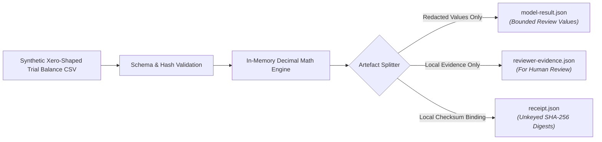

# Data flow and network restrictions

## 1. Purpose and scope

Xero Ledger Review Gate is a **synthetic-only** local design demonstration for
reviewing Xero-shaped trial-balance fixtures. It does not process client exports
or establish that input came from Xero.

## 2. Zero-network contract
- The engine has no HTTP, socket or cloud telemetry libraries.
- It processes data locally in memory and makes no cloud LLM calls.
- It removes or pseudonymises account display names, entity names and identifying metadata before generating any artefact for a downstream agent.

## 3. Data flow model

## 4. Receipt limitation

`receipt.json` is an adjacent, unkeyed local SHA-256 checksum binding. Anyone
who can replace the artefacts can replace the receipt. It detects mismatched
local files, but it does not prove authorship, source system, origin, time, or
immutability.

## 5. Account reference limitation

`account_ref` is an unkeyed, truncated SHA-256 digest of
`<entity_ref>:<account_id>`, and it is stable so one account keeps one reference
across runs. Stability is all it offers. There is no key, so anyone holding the
artefacts can confirm a guessed `account_id` by computing the same digest. A Xero
account GUID is too large a space to enumerate that way. A short account code
such as `200` is not, so a pack whose `account_id` values are codes rather than
GUIDs names its accounts to whoever reads it.
