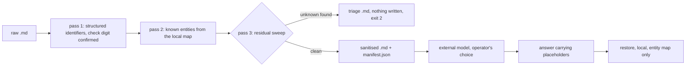

# Data flow and zero-network boundary

## 1. Purpose

evatt performs pseudonymisation with local key retention over markdown files.
**This does not take the data outside the Privacy Act.** It reduces what a
recipient receives; it does not change the character of the data.

## 2. Zero-network contract

- No HTTP client, socket or telemetry library appears in this package.
- No cloud model is called. All processing is in memory, locally.
- The entity map is read from disk and written to disk. It is never sent.
- The one subprocess this package runs is `git`, asked locally whether it
  ignores and does not track the map. It is a question about the working
  directory, not a network call.

## 3. Flow

The operator carries the sanitised file to the model and the answer back. evatt
does not make that journey and cannot see it.

## 4. What the manifest holds

Counts by kind. No values. A manifest that carried the values would defeat the
purpose of the file it accompanies.

## 5. What stays on the local disk

The entity map, its `.tmp` while it is being replaced, and any triage file. All
three name real values or real candidates. Every command refuses to read a map
git would let you commit, and a halt refuses to write a triage file at a path
git would let you commit.

The rules covering those three names live in this repository's `.gitignore`.
That file is in neither the wheel nor the source distribution, so an installed
user has none of them and has to write the equivalent rules in the repository
their map and their runs live in. The guards are what enforce the rule; the
shipped file only satisfies it here.

`restore --out` is not guarded. It writes real names to an operator-chosen path
that can be anywhere, so no rule the package could name would cover it. Keeping
that path out of a commit is the operator's.

## 6. Limits

Detection is by regular expression and check digit for structured identifiers,
and by an operator-maintained map for named entities. Neither understands
context. Contextual re-identification is not addressed here.

`verify` re-runs that same detection over the output. It catches redaction
applied wrongly; it does not catch a detection bug, because it uses the
detector whose bug it would have to see past.

There is no ATO client reference detector. No single fixed published format
exists for one, so a pattern would be guesswork. That gap is a named limit, not
an oversight, and a document carrying a client reference has to be triaged by
the human check.
